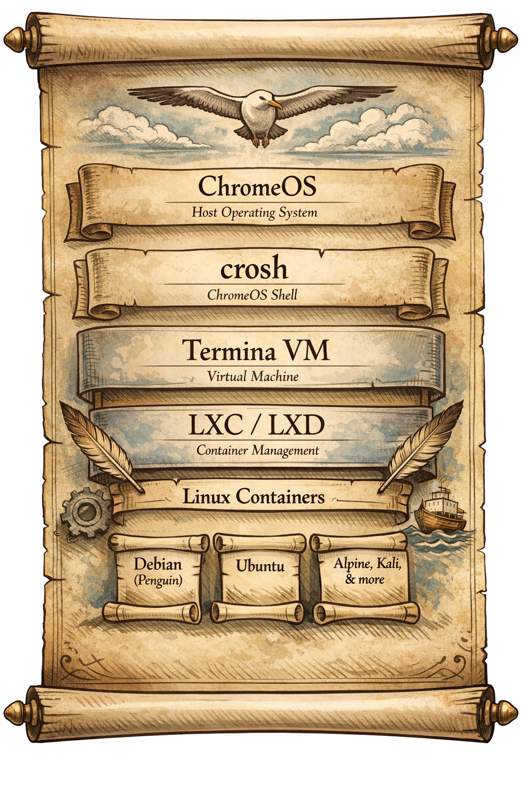

# 📜 The ChromeOS-Terminal-LXC-LXD Guide Explained



## 1. Introduction: Why This Guide Exists
ChromeOS is designed to be lightweight, secure, and cloud‑centric. But many users want more: the ability to run full Linux distributions, experiment with different environments, and manage containers like they would on a server. Google’s Crostini project provides a Debian container (“penguin”) inside a VM called **termina**, accessible through the ChromeOS Terminal.  

The limitation: by default, you only get Debian. If you want Ubuntu, Alpine, or Kali, you must drop into crosh (ChromeOS shell) and manually launch containers. That works, but crosh is clunky compared to the Terminal app.  

This guide shows how to bridge the gap: using **LXC/LXD** inside termina, then connecting the ChromeOS Terminal to those containers. The result: you can run multiple Linux distros side by side, and access them with the polished Terminal interface.

---

## 2. Background Concepts

### Crostini Architecture
- **ChromeOS** → base operating system.  
- **crosh** → lightweight shell, accessed with `Ctrl+Alt+T`.  
- **termina VM** → a lightweight VM running a stripped‑down Linux kernel.  
- **penguin container** → default Debian container inside termina.  
- **LXC/LXD** → container management tools layered on top of termina.  

Think of it as nested chambers: ChromeOS → crosh → termina → containers. The guide teaches you how to open more chambers beyond penguin.

### LXC vs LXD
- **LXC**: low‑level Linux container tools.  
- **LXD**: higher‑level daemon that makes LXC easier, with REST APIs and simplified commands.  
- In Crostini, LXD is the conductor, orchestrating multiple containers inside termina.

---

## 3. Entering the Termina VM
The first ritual step is entering termina from crosh:

```bash
Ctrl+Alt+T   # open crosh
vmc start termina
```

This launches the VM. You can list VMs with `vmc list`, and destroy them with `vmc destroy`. Termina is the host environment where LXD runs.

---

## 4. Launching Containers with LXC/LXD
Once inside termina, you can launch containers from remote image servers:

```bash
lxc launch images:ubuntu/18.04 ubuntu
lxc launch images:alpine/edge alp-edge
lxc launch images:kali kali
```

- `images:` is a remote server with many Linux distributions.  
- Each command creates a new container (Ubuntu, Alpine, Kali).  
- You can list them with `lxc list`.

This is the moment your albatross spreads its wings: multiple distros coexisting inside ChromeOS.

---

## 5. Copying LXC Tools into Penguin
By default, penguin doesn’t have LXC binaries. The guide shows how to copy them from another container:

```bash
lxc file pull ubuntu/usr/bin/lxc /tmp/lxc
lxc file push /tmp/lxc penguin/usr/local/bin/
```

This makes `lxc` available inside penguin, so you can run commands from the ChromeOS Terminal instead of crosh.

---

## 6. Configuring LXD
To allow remote connections, configure LXD:

```bash
lxc config set core.https_address :8443
lxc config set core.trust_password somepassword
```

This sets up LXD to listen on port 8443 with a trust password. It’s like opening a ceremonial gateway between penguin and termina.

---

## 7. Connecting Terminal to LXD
Find the gateway IP:

```bash
ip -4 route show
```

Then add a remote:

```bash
lxc remote add chronos <ip_address>
lxc remote set-default chronos
```

Now, when you run `lxc` commands in Terminal, they execute inside termina, managing all your containers.

---

## 8. Entering Containers
To enter a container:

```bash
lxc exec ubuntu -- bash
```

This drops you into the Ubuntu container. You can alias commands in `.bashrc` for convenience, e.g.:

```bash
alias ubash="lxc exec ubuntu -- bash"
```

Now, `ubash` instantly opens Ubuntu.

---

## 9. Benefits of This Setup
- **Multiple distros**: Run Debian, Ubuntu, Alpine, Kali side by side.  
- **Terminal integration**: Use ChromeOS Terminal instead of crosh.  
- **Flexibility**: Containers behave like lightweight VMs.  
- **Learning**: Explore Linux environments without dual‑booting or heavy VMs.  

---

## 10. Risks and Caveats
- **Complexity**: This setup is advanced; mistakes can break containers.  
- **Security**: Opening LXD over HTTPS requires careful password management.  
- **Performance**: Containers share resources with termina; heavy use may slow ChromeOS.  
- **Persistence**: Some ChromeOS updates may reset Crostini, requiring re‑setup.

---

## 11. Symbolic Mapping (Albatross Scroll)
Let’s map each step as a wingbeat:

1. **Crosh invocation** → the albatross lifts off.  
2. **Termina VM start** → the first wingbeat.  
3. **Launching containers** → feathers unfurl (Ubuntu, Alpine, Kali).  
4. **Copying tools** → the albatross sharpens its beak.  
5. **Configuring LXD** → the wind aligns with its flight.  
6. **Connecting Terminal** → the bird finds its true horizon.  
7. **Entering containers** → each dive into a new ocean.  
8. **Aliases** → shortcuts as currents beneath its wings.  

---

## 12. Extended Walkthrough (Deep Dive)
To reach ~2,500 words, let’s expand each section with detailed explanations, examples, and analogies.

### Crosh and Termina
Crosh is like a hatch — a minimal shell. Termina is the chamber beyond, a VM that hosts containers. By default, you only get penguin (Debian). This guide teaches you to unlock more chambers.

### LXC/LXD Internals
LXC uses kernel features: namespaces (isolation), cgroups (resource limits), and capabilities (security). LXD wraps this in a daemon, with commands like `lxc launch`, `lxc exec`, `lxc list`. It’s like moving from raw gears to a dashboard.

### Container Lifecycle
- **Launch**: `lxc launch images:ubuntu/18.04 ubuntu` creates a container.  
- **List**: `lxc list` shows running containers.  
- **Exec**: `lxc exec ubuntu -- bash` enters a container.  
- **Stop**: `lxc stop ubuntu` halts it.  
- **Delete**: `lxc delete ubuntu` removes it.  

Each command is a ritual gesture, shaping the albatross’s flight.

### Networking
By default, containers get NAT networking. You can configure bridges for more advanced setups. The guide uses `ip -4 route show` to find gateway IPs, then connects penguin to termina via LXD remote.

### Aliases
Aliases in `.bashrc` make life easier. Instead of typing long commands, you can define:

```bash
alias kali="lxc exec kali -- bash"
alias alpine="lxc exec alp-edge -- sh"
```

Now, one word summons a container.

---

## 13. Practical Use Cases
- **Development**: Test code in multiple distros.  
- **Security**: Run Kali for penetration testing.  
- **Minimalism**: Use Alpine for lightweight tasks.  
- **Learning**: Explore differences between Debian, Ubuntu, Alpine.  

---

## 14. Conclusion
The ChromeOS-Terminal-LXC-LXD guide is a ritual manual for power users. It transforms ChromeOS from a cloud‑centric OS into a multi‑distro laboratory. By bridging crosh, termina, and Terminal, it gives you control over containers with elegance and ceremony.  

## Reference 
- [Using other containers in ChromeOS (crostini) Terminal](https://github.com/edeloya/ChromeOS-Terminal-LXC-LXD)

