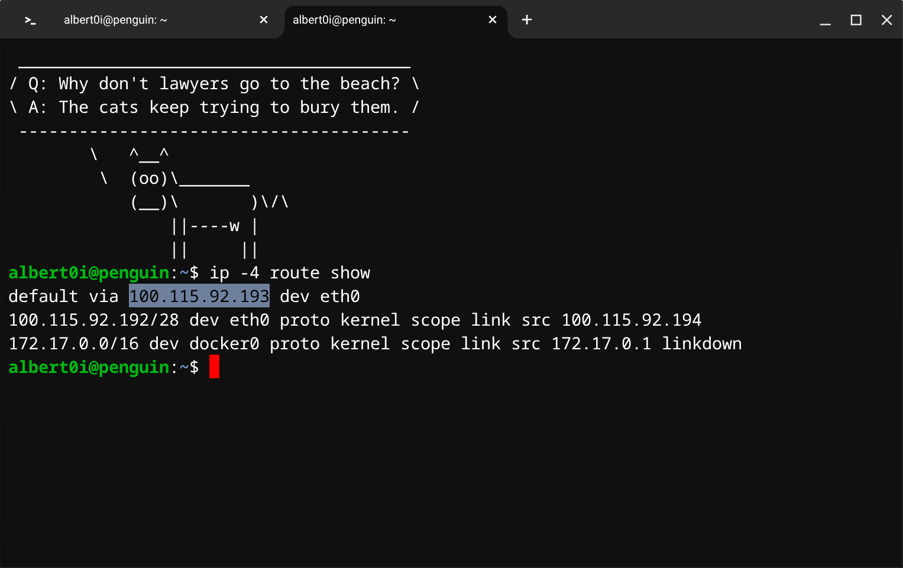
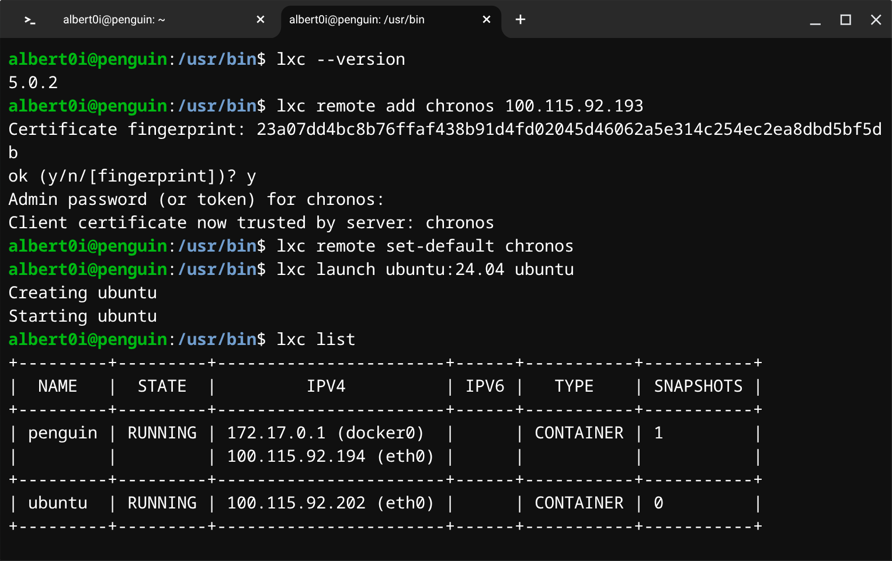
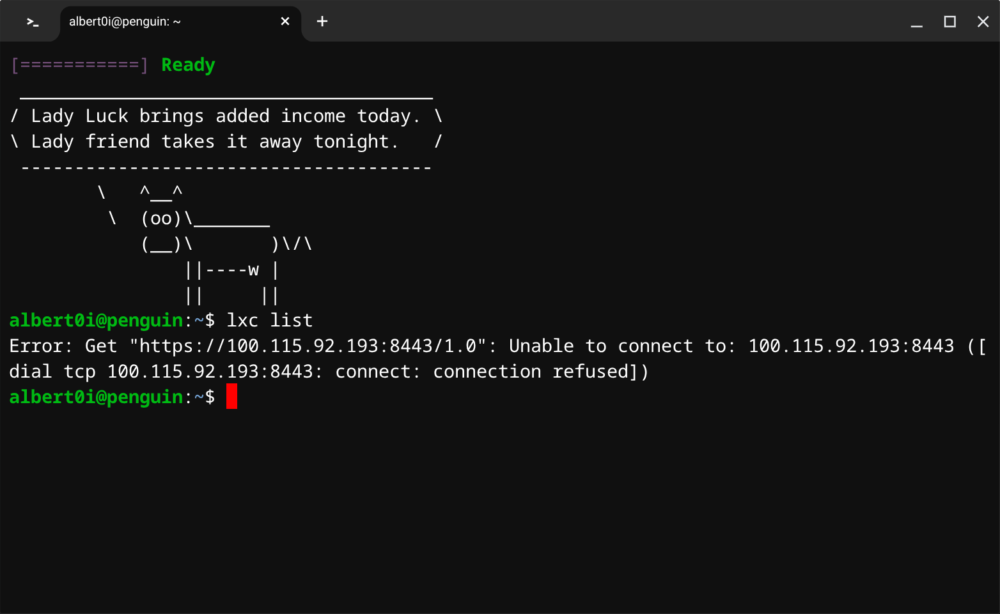
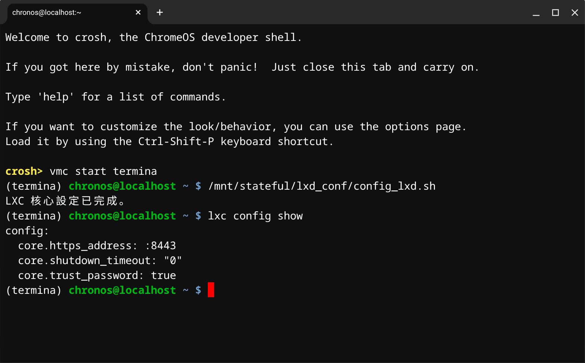
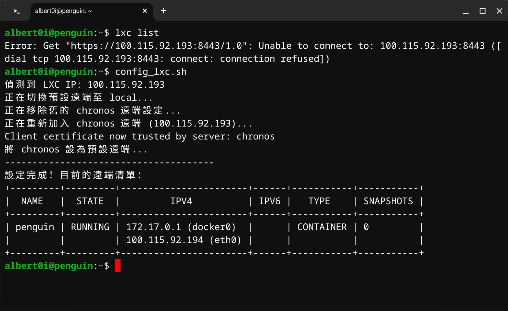
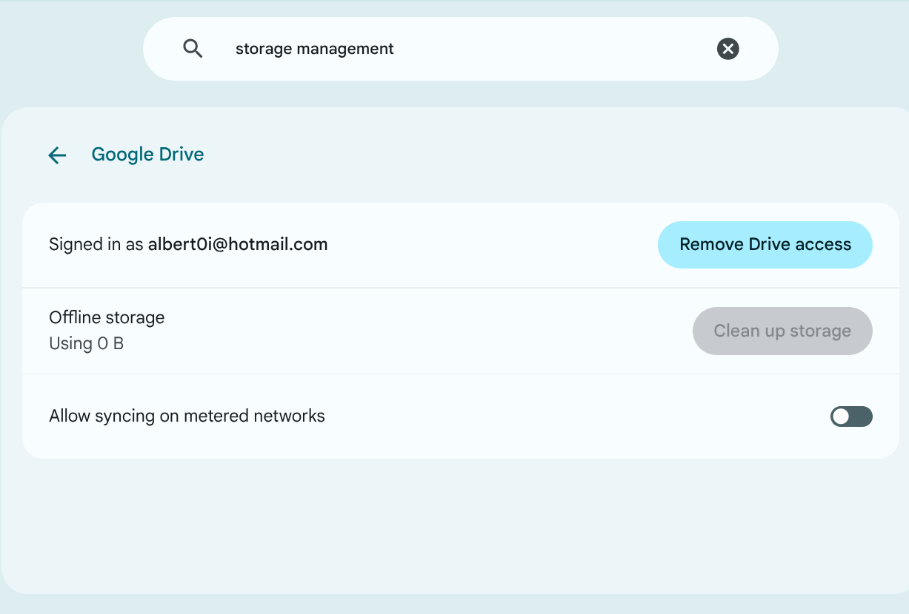
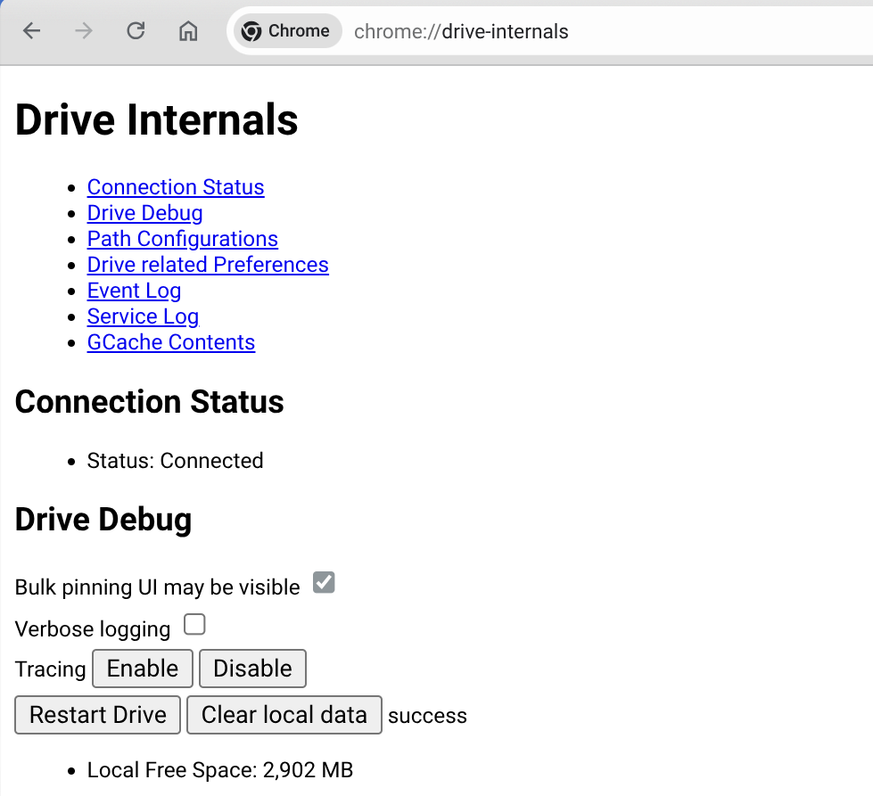
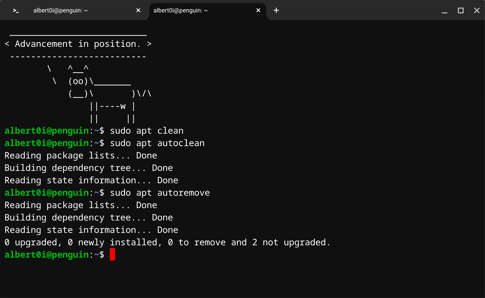
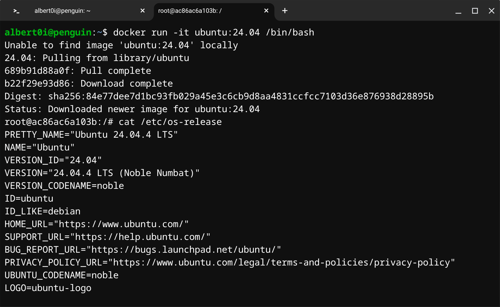

### 一個人的戰爭 <br />── Sequel to “[The Feather of Chromebook](https://github.com/Albert0i/The-Road-Not-Taken/blob/main/README.md#iv-the-feather-of-chromebook)” 


> "If there’s one thing I hate, it’s a reformer. A reformer is a man who
sees the world’s superficial ills and sets out to cure them by
aggravating the more basic ills. A doctor tries to bring a sick body
into conformity with a normal, healthy body, but we don’t know
what’s healthy or sick in the social sphere"<br />
"Se alguma coisa odeio, é um reformador. Um reformador é um homem que vê os males superficiais do mundo e se propõe curá-los agravando os fundamentais. O médico tenta adaptar o corpo doente ao corpo são; mas nós não sabemos o que é são ou doente na vida social."<br />
── [The Book of Disquiet by Fernando Pessoa](https://dn720004.ca.archive.org/0/items/english-collections-1/Book%20of%20Disquiet%2C%20The%20-%20Fernando%20Pessoa.pdf)

> "Whenever you find yourself on the side of the majority, it is time to pause and reflect". ── Mark Twain


#### Prologue 


#### I. When life does not go smoothly...
Oftentimes, life does not go smoothly, and neither does Crostini....


> **This error indicates that the Crostini Linux virtual machine ("termina") is missing or corrupted. Quick fix: **Open Settings > About ChromeOS > Developers > Linux development environment > Disk size (change), and change the value slightly to force a reload. Alternatively, restart your Chromebook and try launching the Terminal app again.

**Steps to Fix "Termina" Missing or Erroring:**

- **Try Refreshing Settings:** Simply visiting the Linux settings page often forces the system to recognize the VM.


- **Reboot & Update:** Restart your Chromebook. Check for ChromeOS updates and ensure components are updated.

-- **Check via Command Line (Crosh):**
1. Press `Ctrl+Alt+T` to open crosh.
2. Type `vmc list` to see if `termina` exists.
3. If it doesn't appear or is broken, `try vmc start termina`.

- **Reinstall Linux (Last Resort):** If the VM cannot be recovered, go to **Settings > Advanced > Developers > Linux development environment** and Remove it, then re-enable it. Note: This deletes all data in the Linux files folder. 


#### II. Backup and Restore 
Once Crostini is up and running, you can make backup to safeguard your work: 


This will create a `chromeos-linux-yyyy-mm-dd.img.zst`, a [zst](https://peazip.github.io/zst-compressed-file-format.html) file containing your **Linux Development Environment**. Later on, you can restore with this file. 


#### III. Snapshot 
Backup/Restore is a time-consuming process, if you want to experiment some packages, an alternative is to use snapshot. To begin with, press `Ctrl` + `Alt` + `T` to enter Crosh (ChromiumOS shell), to create a snapshot with: 
```
vmc list 
vmc start termina 

lxc list 
lxc snapshot penguin fresh_installed 
```


To restore from snapshot with: 
```
lxc list 
lxc info penguin 

lxc restore penguin fresh_installed 
```

To delete the snapshot with: 
```
lxc delete penguin/fresh_installed
```

Creating a snapshot is placing another layer on top of your container and thus slightly degrades performance. Use it with care.


#### IV. More Utilities 
- [Brave Browser](https://brave.com/linux/)

For some unknown reason, you don't want to use [Google Chrome](https://www.google.com/chrome/) nor [Microsoft Edge](https://www.microsoft.com/en-us/edge/download?form=MA13FJ), then give it a shot!
```
curl -fsS https://dl.brave.com/install.sh | sh
```


- [drawio](https://www.drawio.com/)

If you need to draw [Flowchart](https://en.wikipedia.org/wiki/Flowchart), [Entity–relationship model](https://en.wikipedia.org/wiki/Entity%E2%80%93relationship_model), [Data-flow diagram](https://en.wikipedia.org/wiki/Data-flow_diagram) etc... 
```
sudo dpkg -i ./drawio-amd64-29.6.6.deb
```


#### V. [LXC](https://linuxcontainers.org/lxc/introduction/) and LXD 
> LXC is a userspace interface for the Linux kernel containment features. Through a powerful API and simple tools, it lets Linux users easily create and manage system or application containers.

> LXD (pronounced lex-dee) is a powerful, open-source next-generation system container and virtual machine manager developed by Canonical. It allows users to manage full Linux systems in lightweight containers or VMs, offering a cloud-like experience on local machines or clusters. LXD provides advanced features like live migration, snapshots, and image-based workflows.


To start another container from `Termina`: 
```
lxc launch ubuntu:24.04 ubuntu

lxc list 
```


To start another VM from `Termina`: 
```
lxc launch ubuntu:24.04 --vm
```


To Configure `lxd` in `Termina`: 
```
lxc config set core.https_address :8443

lxc config set core.trust_password somepassword
```

To install `lxc` in `Terminal`: 
```
sudo apt update
sudo apt install lxd-client

sudo ln -s /usr/bin/lxc /usr/local/bin/lxc
```

To configure `lxc` in `Terminal`: 
```
ip -4 route show
```



```
lxc remote add chronos 100.115.92.193
lxc remote set-default chronos
```




By dint of LXD, we can now start an `ubuntu:24.04` container from our `penguin` container. As you can see, two containers are running side by side. 


#### VI. [LXC](https://linuxcontainers.org/lxc/introduction/) and LXD (Cont.)
The bad news is: **Changes we made in `Termina` is NOT persistent!!!**



--- 

Suggestion from AI: 

**使用 ChromeOS Flags (終極方案)**
1. 瀏覽器開啟 `chrome://flags/#crostini-container-install-lxd`
2. 將其設為 `Disabled`。
3. 重啟 Chromebook。

這會讓系統嘗試在容器初始化時自動配置橋接。

That is an *experimental* feature and I can't risk screwing it up... My only option left is to find a way to easily do the re-configure. 

Press `Ctrl` + `Alt` + `T` to enter Crosh (ChromiumOS shell): 
```
vmc start termina 
cd /mnt/stateful/lxd_conf

cat << 'EOF' > config_lxd.sh
#!/bin/bash
lxc config set core.https_address :8443
lxc config set core.trust_password somepassword
echo "LXC 核心設定已完成。"
EOF
```

Make it executable: 
```
chmod +x config_lxd.sh
```

And run it: 
```
./config_lxd.sh
```

`config_lxc.sh`
```
#!/bin/bash

# 1. 自動獲取 Google 內部網路的 IP 位址 (通常是 100.115.92.xxx)
LXC_IP=$(ip -4 route show | grep -oP '100\.115\.92\.\d+' | head -n 1)
PASSWORD=somepassword

if [ -z "$LXC_IP" ]; then
    echo "錯誤：找不到符合 100.115.92.x 的 IP 位址。請確認是否在 Chromebook 的 Debian 環境中。"
    exit 1
fi

echo "偵測到 LXC IP: $LXC_IP"

# 2. 將預設遠端切換回 local (確保刪除 chronos 時不會報錯)
echo "正在切換預設遠端至 local..."
lxc remote switch local

# 3. 移除現有的 chronos 設定 (如果存在)
if lxc remote list | grep -q "chronos"; then
    echo "正在移除舊的 chronos 遠端設定..."
    lxc remote remove chronos
fi

# 4. 重新加入遠端
echo "正在重新加入 chronos 遠端 ($LXC_IP)..."
#lxc remote add chronos 100.115.92.193
lxc remote add chronos "$LXC_IP" --accept-certificate --password "$PASSWORD"

# 5. 設定為預設遠端
echo "將 chronos 設為預設遠端..."
lxc remote set-default chronos

echo "--------------------------------------"
echo "設定完成！目前的遠端清單："
lxc list
```

Put `config_lxc.sh` on `/usr/local/bin` and make it executable. Next time, press `Ctrl` + `Alt` + `T` to enter Crosh (ChromiumOS shell): 
```
vmc start termina
/mnt/stateful/lxd_conf/config_lxd.sh
lxc config show
```



In `Terminal`: 
```
config_lxc.sh
```




#### VII. [Lost in Space](https://en.wikipedia.org/wiki/Lost_in_Space) 
Chrome OS buffers files and you may find space lost sometimes, use the `Clean up storage` to remove `Offline Storage`.



To Clear Google Drive Offline Files, go to:  
```
chrome://drive-internals/
```



and Press `Clear local data`.

As of Debian our container: 

1. Remove all cached package files:
```
sudo apt clean
```
This clears `/var/cache/apt/archives/` and `/var/cache/apt/archives/partial/`.

2. Remove obsolete package files:
```
sudo apt autoclean
```
Removes cached packages that can no longer be downloaded.

3. Remove unused dependencies:
```
sudo apt autoremove
```
Removes packages that were automatically installed and are no longer needed. 



Keep it clean and tidy.


#### VII. Summary 
- Chromebook is optimized for lightweight web-based applications,  Crostini is a bonus. While Chrome OS need no maintenance cost, Crostini has fragility somehow. After all, it is only a Debian 12 container inside a Virtual Machine in Chrome OS. 

- Regarding to the size of **Linux Development Environment**, my rule of thumb is: not *exceed* half of total available space. In my case, my Chromebook has 64G SSD, around 35.5G is available at my disposal. That means at most 15G can be allocated for **Linux Development Environment**, 10~12G is a safer bet... Otherwise you run the risk of unable to restore your backup. 

- To run an **Ubuntu 24.04** container, the easier way is: 
```
docker run -it ubuntu:24.04 /bin/bash
```


Is it not? 


#### IX. Bibliography 
1. [Set up Linux on your Chromebook](https://support.google.com/chromebook/answer/9145439)
2. [Crostini developer guide](https://www.chromium.org/chromium-os/developer-library/guides/containers/crostini-developer-guide/)
3. [Running Custom Containers Under ChromeOS](https://www.chromium.org/chromium-os/developer-library/guides/containers/containers-and-vms/)
4. [Linux for Chromebooks: Secure Development (Google I/O ’19)](https://youtu.be/pRlh8LX4kQI)
5. [Using other containers in ChromeOS (crostini) Terminal](https://github.com/edeloya/ChromeOS-Terminal-LXC-LXD)
6. [Container and virtualization tools](https://linuxcontainers.org/)
7. [The Book of Disquiet by Fernando Pessoa](https://dn720004.ca.archive.org/0/items/english-collections-1/Book%20of%20Disquiet%2C%20The%20-%20Fernando%20Pessoa.pdf)


#### Epilogue 


### EOF (2026/04/17)
