### 一個人的戰爭 <br />── Sequel to “[The Feather of Chromebook](https://github.com/Albert0i/The-Road-Not-Taken/blob/main/README.md#iv-the-feather-of-chromebook)” 


> "If there’s one thing I hate, it’s a reformer. A reformer is a man who
sees the world’s superficial ills and sets out to cure them by
aggravating the more basic ills. A doctor tries to bring a sick body
into conformity with a normal, healthy body, but we don’t know
what’s healthy or sick in the social sphere"<br />
"Se alguma coisa odeio, é um reformador. Um reformador é um homem que vê os males superficiais do mundo e se propõe curá-los agravando os fundamentais. O médico tenta adaptar o corpo doente ao corpo são; mas nós não sabemos o que é são ou doente na vida social."<br />
── [The Book of Disquiet by Fernando Pessoa](https://dn720004.ca.archive.org/0/items/english-collections-1/Book%20of%20Disquiet%2C%20The%20-%20Fernando%20Pessoa.pdf)

> "Whenever you find yourself on the side of the majority, it is time to pause and reflect". ── Mark Twain


#### Prologue 
With basic understanding of how Crostini works: 

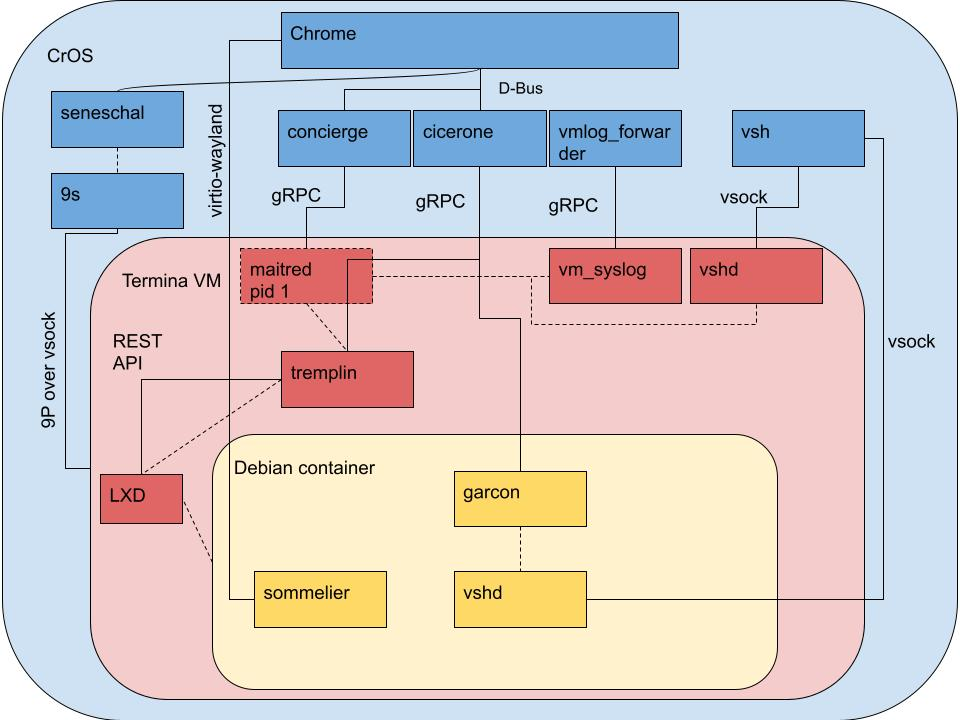

Two trivial questions dawns upon me: 
1. How to run multiple containers?
2. How to run multiple VMs?


#### I. When life does not go smoothly...
Oftentimes, life does not go smoothly, and neither does Crostini....

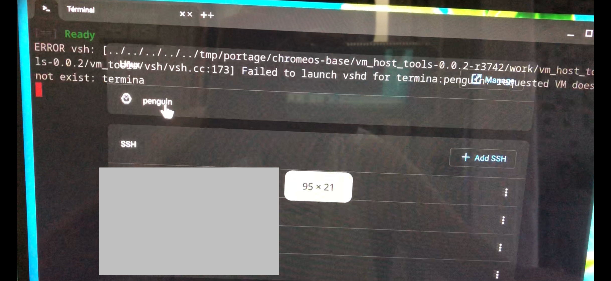

> **This error indicates that the Crostini Linux virtual machine ("termina") is missing or corrupted. Quick fix: **Open Settings > About ChromeOS > Developers > Linux development environment > Disk size (change), and change the value slightly to force a reload. Alternatively, restart your Chromebook and try launching the Terminal app again.

**Steps to Fix "Termina" Missing or Erroring:**

- **Try Refreshing Settings:** Simply visiting the Linux settings page often forces the system to recognize the VM.

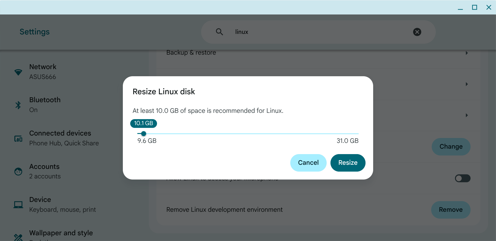

- **Reboot & Update:** Restart your Chromebook. Check for ChromeOS updates and ensure components are updated.

-- **Check via Command Line (Crosh):**
1. Press `Ctrl+Alt+T` to open crosh.
2. Type `vmc list` to see if `termina` exists.
3. If it doesn't appear or is broken, `try vmc start termina`.

- **Reinstall Linux (Last Resort):** If the VM cannot be recovered, go to **Settings > Advanced > Developers > Linux development environment** and Remove it, then re-enable it. Note: This deletes all data in the Linux files folder. 


#### II. Backup and Restore 
Once Crostini is up and running, you can make backup to safeguard your work: 

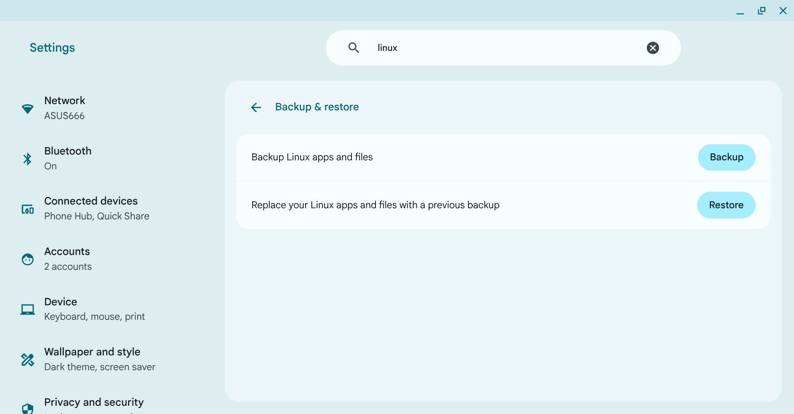

This will create a `chromeos-linux-yyyy-mm-dd.img.zst`, a [zst](https://peazip.github.io/zst-compressed-file-format.html) file containing your linux Development Environment. Later on, you can restore with this file. 


#### III. Snapshot 
Backup/Restore is a time-consuming process, if you want to experiment some packages, an alternative is to use snapshot. To begin with, press `Ctrl` + `Alt` + `T` to enter Crosh (ChromiumOS shell), to create a snapshot with: 
```
vmc list 
vmc start termina 

lxc list 
lxc snapshot penguin fresh_installed 
```

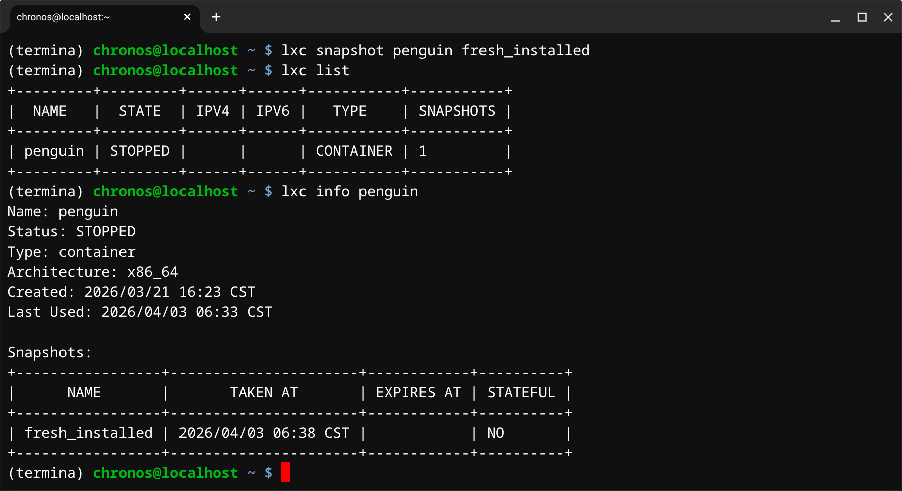

To restore from snapshot with: 
```
lxc list 
lxc info penguin 

lxc restore penguin fresh_installed 
```

To delete the snapshot with: 
```
lxc delete penguin/fresh_installed
```

Creating a snapshot is placing another layer on top of your Crostini and thus will degrade performance a little bit. You should use it with care.


#### IV. More Utilities 
- [Brave Browser](https://brave.com/linux/)

For some unknown reason, you don't want to use [Google Chrome](https://www.google.com/chrome/) nor [Microsoft Edge](https://www.microsoft.com/en-us/edge/download?form=MA13FJ), then give it a shot!
```
curl -fsS https://dl.brave.com/install.sh | sh
```

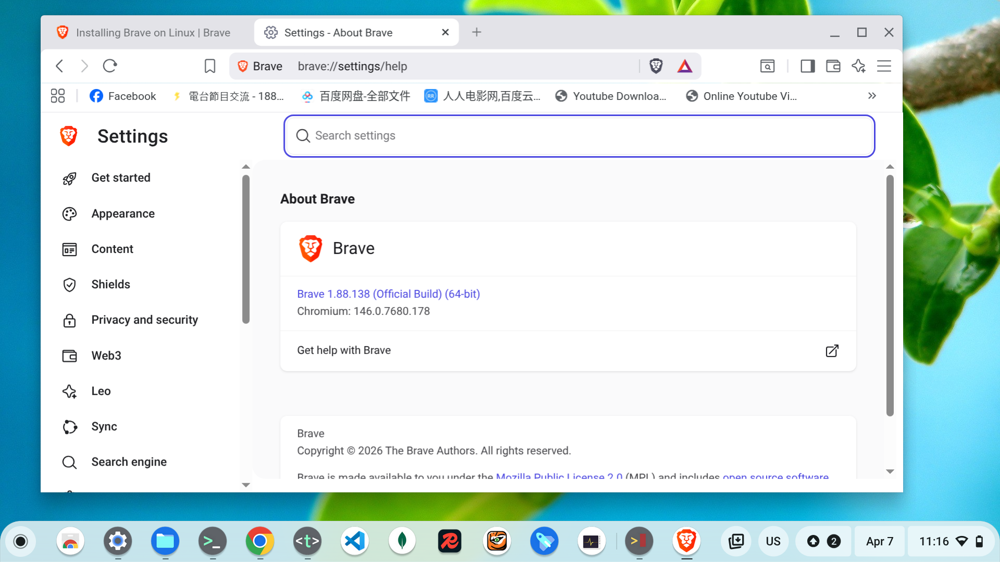

- [drawio](https://www.drawio.com/)

If you need to draw [Flowchart](https://en.wikipedia.org/wiki/Flowchart), [Entity–relationship model](https://en.wikipedia.org/wiki/Entity%E2%80%93relationship_model), [Data-flow diagram](https://en.wikipedia.org/wiki/Data-flow_diagram) etc... 
```
sudo dpkg -i ./drawio-amd64-29.6.6.deb
```

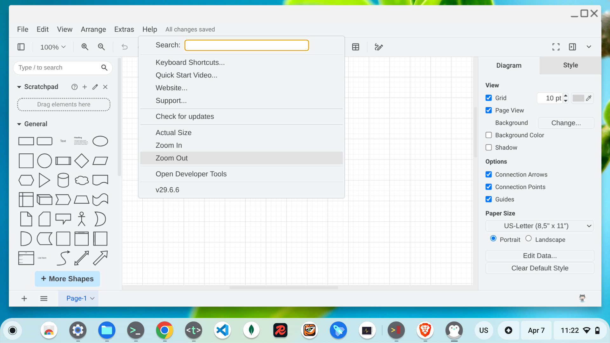


#### V. [LXC](https://linuxcontainers.org/lxc/introduction/) and LXD 
> LXC is a userspace interface for the Linux kernel containment features. Through a powerful API and simple tools, it lets Linux users easily create and manage system or application containers.

> LXD (pronounced lex-dee) is a powerful, open-source next-generation system container and virtual machine manager developed by Canonical. It allows users to manage full Linux systems in lightweight containers or VMs, offering a cloud-like experience on local machines or clusters. LXD provides advanced features like live migration, snapshots, and image-based workflows.

To start another container from `Termina`: 
```
lxc launch ubuntu:24.04 ubuntu

lxc list 
```

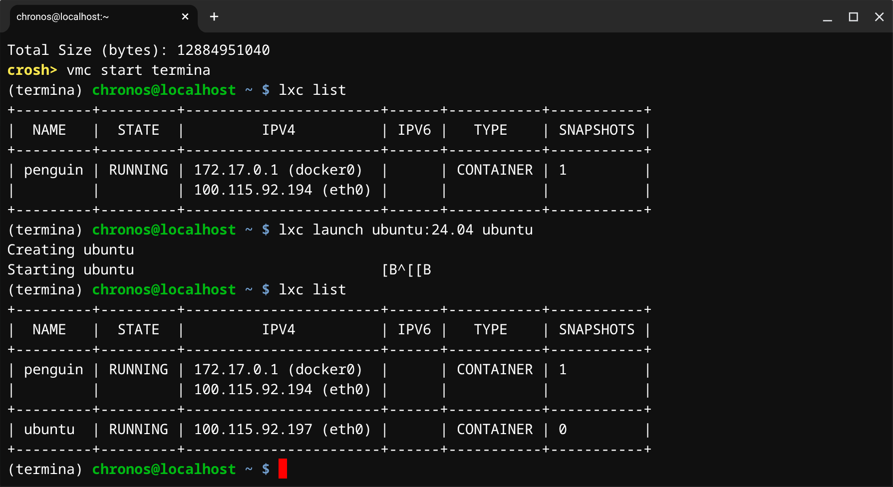

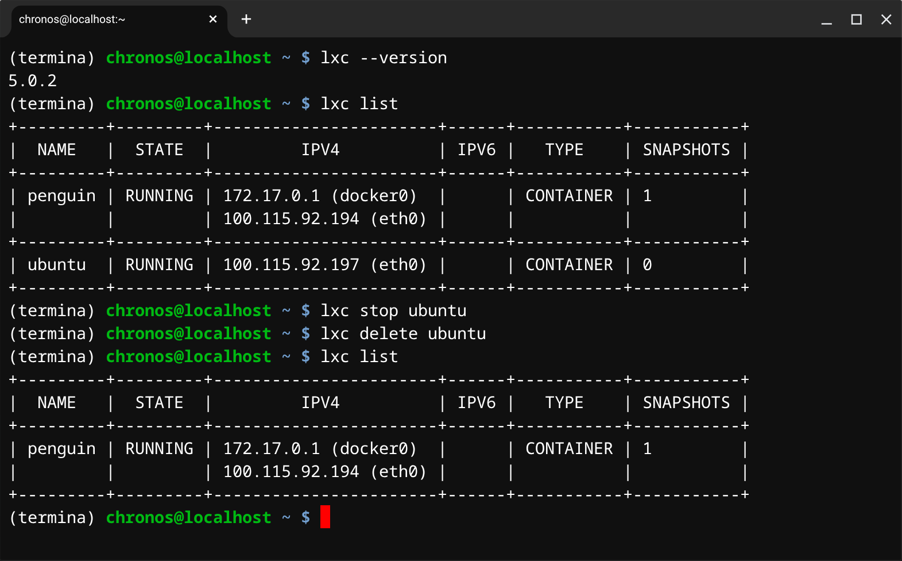

To start another VM from `Termina`: 
```
lxc launch ubuntu:24.04 --vm
```

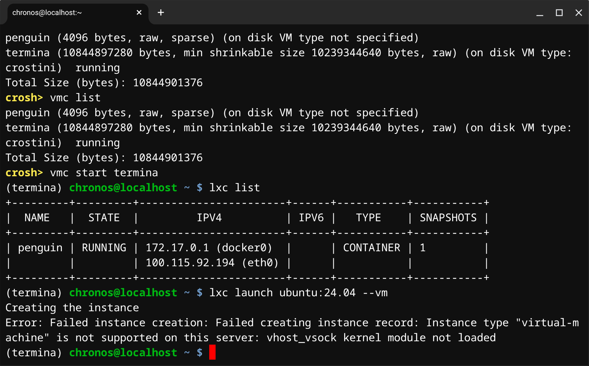


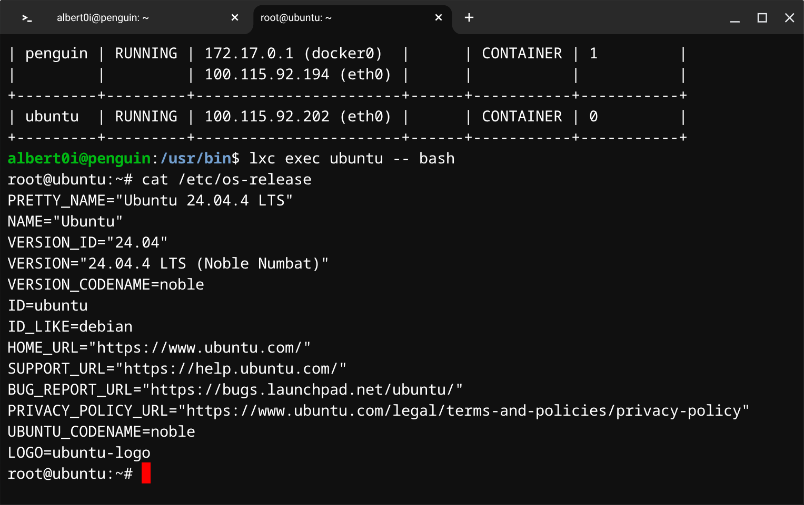


#### VI. [LXC](https://linuxcontainers.org/lxc/introduction/) and LXD (Cont.)


#### VII. Lost in Space 


#### VII. Summary 


#### IX. Bibliography 
1. [Set up Linux on your Chromebook](https://support.google.com/chromebook/answer/9145439)
2. [Crostini developer guide](https://www.chromium.org/chromium-os/developer-library/guides/containers/crostini-developer-guide/)
3. [Running Custom Containers Under ChromeOS](https://www.chromium.org/chromium-os/developer-library/guides/containers/containers-and-vms/)
4. [Linux for Chromebooks: Secure Development (Google I/O ’19)](https://youtu.be/pRlh8LX4kQI)
5. [Using other containers in ChromeOS (crostini) Terminal](https://github.com/edeloya/ChromeOS-Terminal-LXC-LXD)
6. [Container and virtualization tools](https://linuxcontainers.org/)
7. [The Book of Disquiet by Fernando Pessoa](https://dn720004.ca.archive.org/0/items/english-collections-1/Book%20of%20Disquiet%2C%20The%20-%20Fernando%20Pessoa.pdf)


#### Epilogue 


### EOF (2026/04/xx)
