### 726 Investigation Report  ── Sequel to “[The Touch of Vintage](https://github.com/Albert0i/The-Road-Not-Taken/blob/main/README.md#v-the-touch-of-vintage)” 

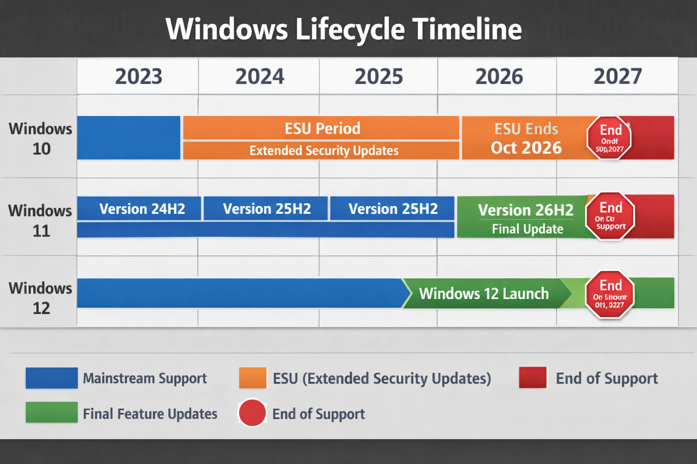

> "Dogs and men, cats and heroes, fleas and geniuses – we all play at existing without thinking about it (the most advanced of us thinking only about thinking) under the vast stillness of the stars." 
"Cães e homens, gatos e heróis, pulgas e génios, brincamos a existir, sem pensar nisso (que os melhores pensam só em pensar) sob o grande sossego das estrelas." 
── [The Book of Disquiet by Fernando Pessoa](https://dn720004.ca.archive.org/0/items/english-collections-1/Book%20of%20Disquiet%2C%20The%20-%20Fernando%20Pessoa.pdf)

> "After a final moment of expectation and anxiety, during which Julien was rendered almost beside himself by his excessive emotion, ten o’clock struck from the clock over his head. Each stroke of the fatal clock reverberated in his bosom, and caused an almost physical pang." ── [THE RED AND THE BLACK, A Chronicle of 1830
BY STENDHAL](https://www.gutenberg.org/files/44747/44747-h/44747-h.htm#:~:text=After%20a%20final%20moment%20of%20expectation%20and%20anxiety%2C%20during%20which%20Julien%20was%20rendered%20almost%20beside%20himself%20by%20his%20excessive%20emotion%2C%20ten%20o%E2%80%99clock%20struck%20from%20the%20clock%20over%20his%20head.%20Each%20stroke%20of%20the%20fatal%20clock%20reverberated%20in%20his%20bosom%2C%20and%20caused%20an%20almost%20physical%20pang.)

#### Prologue
In the year of 2026, it is unwise and unsafe to use an unsupported operating system; you paid for it and yet can't upgrade so much the worse. Microsoft has deliberately devised a strict time frame to nudge you forward. It is not possible to escape if you happened to be on the track. 

It is said that Windows 8 died from tablet ambition, Windows 10 died from Cloud Integration and Windows 11 died from of AI... Three consecutive failures erode the empire from ground up. Windows 11 plays the role of **Advertising Platform**, **Cloud Service Gateway** and **AI Agent** instead of serving you. To leave is painful, to stay is harmful, nostalgic sensation and remembrance to the past make you endure until you can't. 

> A "Windows refugee" is a term for a user transitioning from Microsoft Windows to an alternative operating system—most commonly Linux or macOS due to frustration with Windows updates, telemetry, or system requirements.

#### I. Back to the Origin
Instead of upgrading to Windows 12, what if I downgrade to Windows 7?
I have no Windows 7 activation key on hand and it’s no longer possible to obtain one through *official* channels and there are many second‑hand touts selling dubious keys.

IMHO, Windows 7 can be used for a while but not for long and let alone forever... Chances are you need a kind of [Win64](https://en.wikipedia.org/?title=Win64&redirect=no)/[Win32](https://en.wikipedia.org/?title=Win32&redirect=no) Subsystem to run legacy Windows apps on Linux host and you don't want to dedicate too much resources on it. In this scenario, Windows 7 is of great help to you. The bottom line is: 

1. Windows 7 64 bits is a *must* - It may not be able to run the latest software, it's always possible to find a slightly stale version of it; 
2. Apply all updates till January 14, 2020 - In order to minimize the risk of being compromised; 
3. Antivirus - A paid Antivirus comes with Firewall Support is hightly recommended if financial resource permits. 

In addition to [Microsoft Edge](https://www.microsoft.com/en-us/edge/download?ep=2053&es=356&cs=3457492030&form=MA13FJ), more decent web browsers are available: 
- [Brave](https://brave.com/)
- [Supermium](https://win32subsystem.live/supermium/)
- [LibreWolf](https://librewolf.net/)

#### II. Windows Update 
First things first, You can’t directly download a Windows 7 SP1 ISO from Microsoft’s official site but it's easy to grab it from [Internet Archive](https://archive.org/), the size is around 3G. Use it on your own risk! 

As Windows 7 officially reached end of support on January 14, 2020. The built-in Windows Update won't work anymore but you have three ways to apply all aforementioned updates. 

1. **Offline update** - Navigate to [Updates: Microsoft Windows 7 Multilingual (flersproget)](https://archive.org/details/windows7updates24): 

.JPG)

`wou-w61-x64 [2026-v2].iso` and `Gwou-w61-x86 [2026-v2].iso` are available and you need the x64 one. Download and mount the .iso on target machine and run `UpdateInstaller.exe`. 

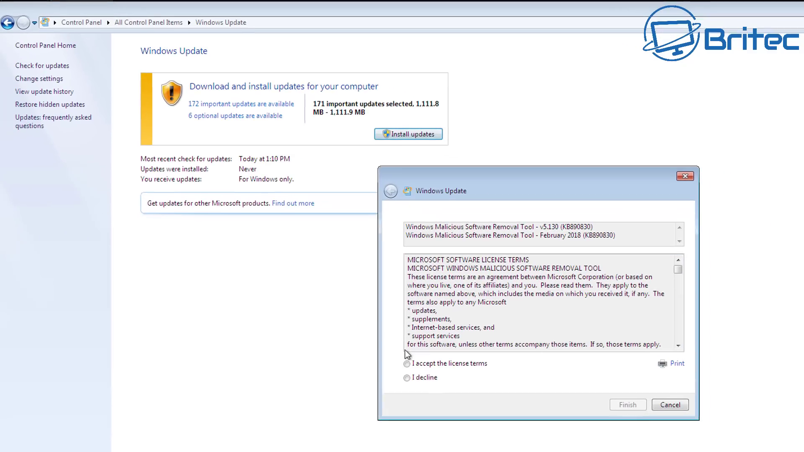

It runs for hours and reboots several times until finish. 

2. **Manual update** - In case of update failures, navigate to [MicrosoftRUpdate Catalog](https://catalog.update.microsoft.com/Home.aspx), type `KB2676562`, for example, and press `Search`.

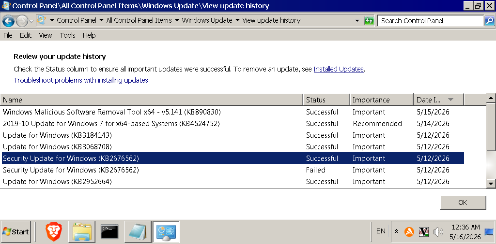
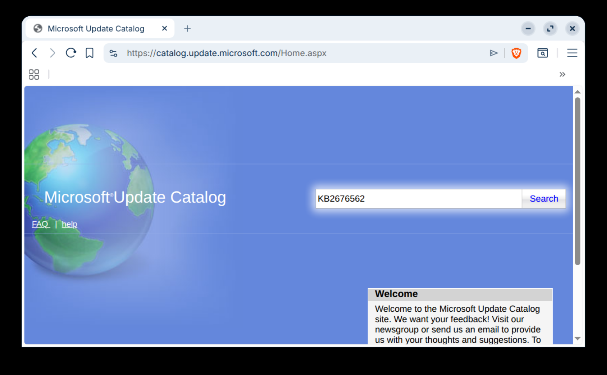

Choose the one match your platform and press `Download.` 

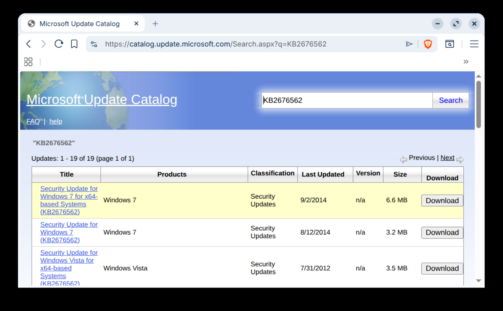
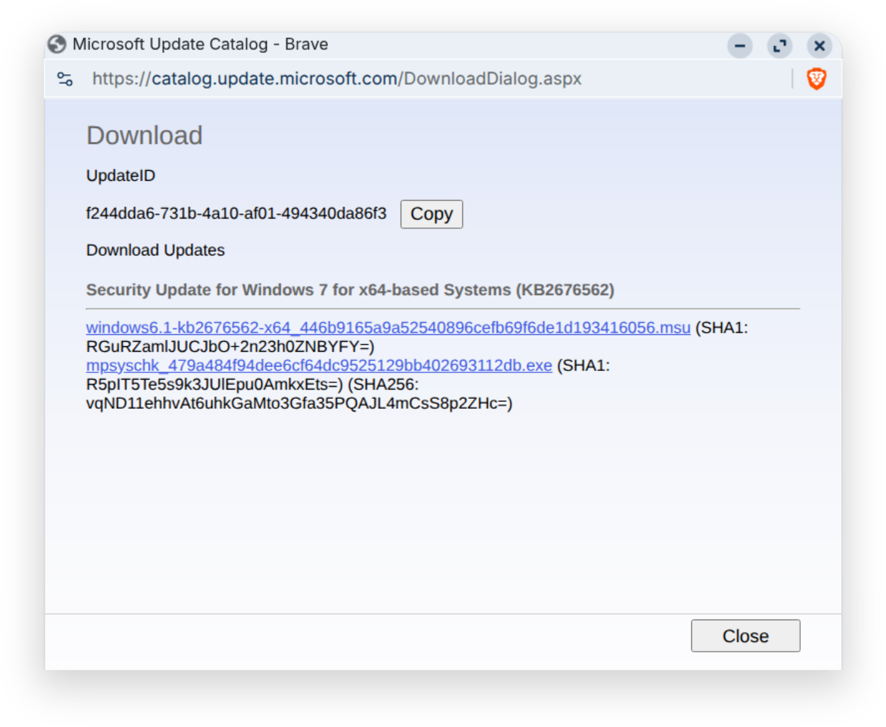

Run the `.exe` accordingly, the problem of this approach is too TEDIOUS; 

3. **Automatic update** via third part software - Navigate to [Legacy Update](https://legacyupdate.net/), download `LegacyUpdate-1.13.exe` and install it. Legacy Update perform the same task as Windows Update. The problem of this approach is too SLOW.

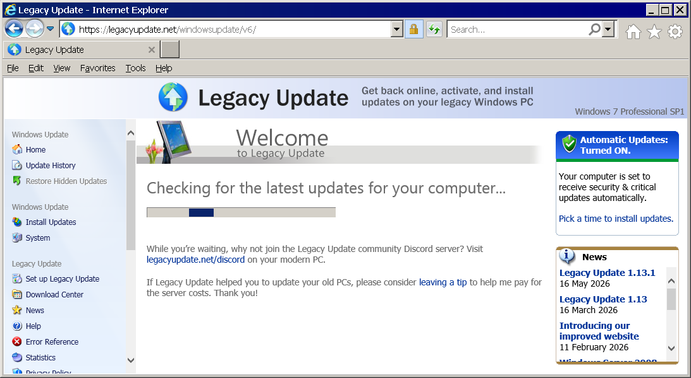

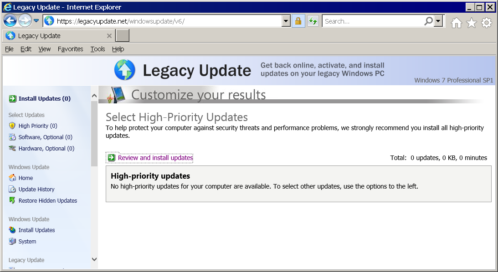

#### III. The Major issues 
- Using Windows 7 unactivated for more than 30 days: 
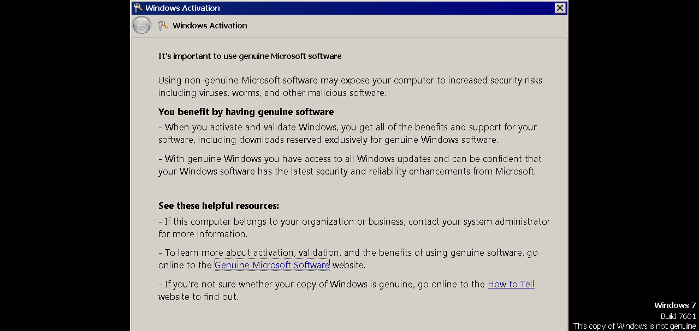

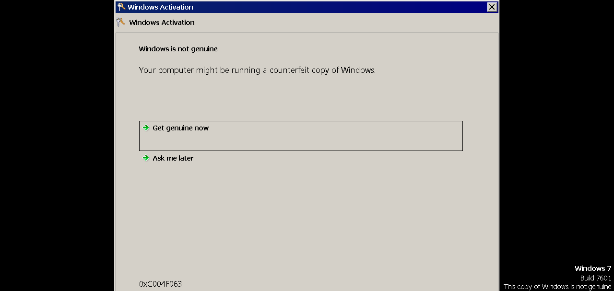

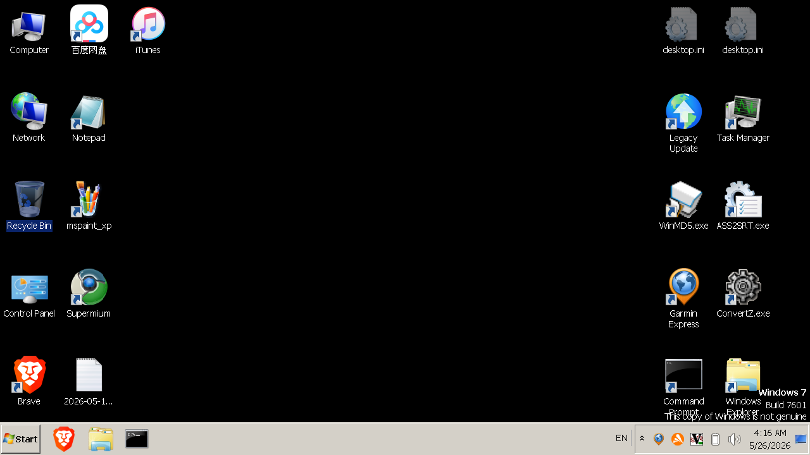

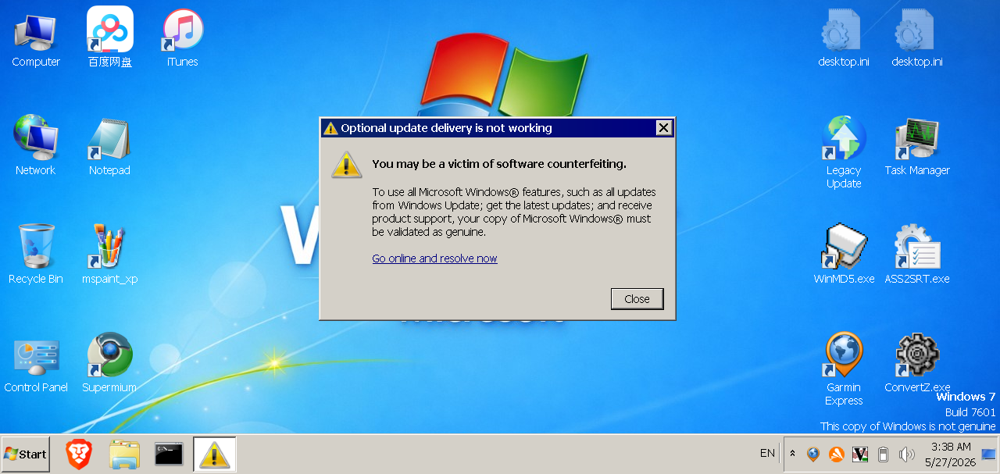

Every time when Windows 7 starts, you are requested to activate or else the wallpaper turns into black and `This copy of Windows is not genuine` appears on the right corner. You can set your wallpaper back but one hour later, it happens again. Rumors say that you will suffer from unexpected shutdown so and so but it *just* doesn't happen in my installation. 

- Windows 7 supports USB 2.0 natively. It also supports USB 3.0, but only if you install the proper drivers — they’re not built into the OS. Without those drivers, USB 3.0 ports behave like USB 2.0.  To use USB 3.0 ports, you need to install the chipset/host controller drivers provided by the hardware vendor (Intel, AMD, Renesas, etc.). Once those drivers are installed, Windows 7 can fully use USB 3.0 speeds.

#### IV. Summary 
Memory is recollection, we all live in the past in strict sense so to speak...

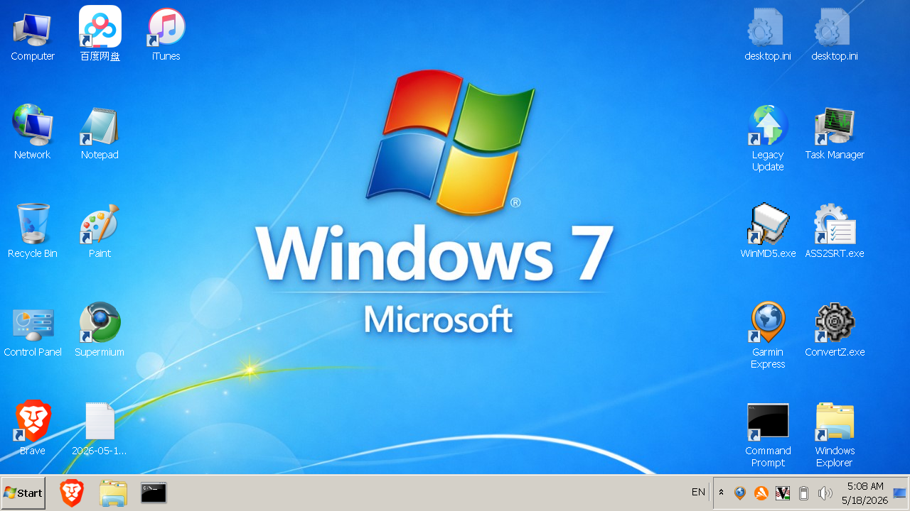

My wallpaper is available in [here](img/Copilot_Windows_7.png), which is a version retouched by Copilot. Enjoy! 

#### V. Bibliography
1. [Windows 7 Full Setup With All Updates and Apps in 2024](https://youtu.be/X1R399OIC1A)
2. [How To Install Windows 7 Updates in 2025 - Fix Error 80072EFE](https://youtu.be/g1e9ZXTlGDQ)
3. [Updates: Microsoft Windows 7 Multilingual (flersproget)](https://archive.org/details/windows7updates24)
4. [Legacy Update](https://legacyupdate.net/)
5. [The Book of Disquiet by Fernando Pessoa](https://dn720004.ca.archive.org/0/items/english-collections-1/Book%20of%20Disquiet%2C%20The%20-%20Fernando%20Pessoa.pdf)

[
#### Epilogue 

> At last they sat down, Madame de Rênal beside Julien, and Madame Derville near her friend. Engrossed as he was by the attempt which he was going to make, Julien could think of nothing to say. The conversation languished.

> “Shall I be as nervous and miserable over my first duel?” said Julien to himself; for he was too suspicious both of himself and of others, not to realise his own mental state.

> In his mortal anguish, he would have preferred any danger whatsoever. How many times did he not wish some matter to crop up which would necessitate Madame de Rênal going into the house and leaving the garden! The violent strain on Julien’s nerves was too great for his voice not to be considerably changed; soon Madame de Rênal’s voice became nervous as well, but Julien did not notice it. The awful battle raging between duty and timidity was too painful, for him to be in a position to observe anything outside himself. A quarter to ten had just struck on the château clock without his having ventured anything. Julien was indignant at his own cowardice, and said to himself, “at the exact moment when ten o’clock strikes, I will perform what I have resolved to do all through the day, or I will go up to my room and blow out my brains.”

> After a final moment of expectation and anxiety, during which Julien was rendered almost beside himself by his excessive emotion, ten o’clock struck from the clock over his head. Each stroke of the fatal clock reverberated in his bosom, and caused an almost physical pang.

> Finally, when the last stroke of ten was still reverberating, he stretched out his hand and took Madame de Rênal’s, who immediately withdrew it. Julien, scarcely knowing what he was doing, seized it again. In spite of his own excitement, he could not help being struck by the icy coldness of the hand which he was taking; he pressed it convulsively; a last effort was made to take it away, but in the end the hand remained in his.

> His soul was inundated with happiness, not that he loved Madame de Rênal, but an awful torture had just ended. He thought it necessary to say something, to avoid Madame Derville noticing anything. His voice was now strong and ringing. Madame de Rênal’s, on the contrary, betrayed so much emotion that her friend thought she was ill, and suggested her going in. Julien scented danger, “if Madame de Rênal goes back to the salon, I shall relapse into the awful state in which I have been all day. I have held the hand far too short a time for it really to count as the scoring of an actual advantage.”

> At the moment when Madame Derville was repeating her suggestion to go back to the salon, Julien squeezed vigorously the hand that was abandoned to him.

> Madame de Rênal, who had started to get up, sat down again and said in a faint voice, “I feel a little ill, as a matter of fact, but the open air is doing me good.”

> These words confirmed Julien’s happiness, which at the present moment was extreme; he spoke, he forgot to pose, and appeared the most charming man in the world to the two friends who were listening to him. Nevertheless, there was a slight lack of courage in all this eloquence which had suddenly come upon him. He was mortally afraid that Madame Derville would get tired of the wind before the storm, which was beginning to rise, and want to go back alone into the salon. He would then have remained tête-à-tête with Madame de Rênal. He had had, almost by accident that blind courage which is sufficient for action; but he felt that it was out of his power to speak the simplest word to Madame de Rênal. He was certain that, however slight her reproaches might be, he would nevertheless be worsted, and that the advantage he had just won would be destroyed.

### EOF (2026/05/28)

I used [Windows 7](https://en.wikipedia.org/wiki/Windows_7) for quite a long time then move to [Windows 10](https://en.wikipedia.org/wiki/Windows_10). And now I am on [Windows 11](https://en.wikipedia.org/wiki/Windows_11), [Open-Shell](https://github.com/Open-Shell/Open-Shell-Menu) is installed and classic theme is chosen to make it looks like Windows 7. 

Windows 7 x64 to January 2026 with ESU ISO (English only)](https://www.threads.com/@thebobpony/post/DTrLVphkcK1/a-fully-updated-windows-x-to-january-with-esu-iso-english-only-that-fully-fills)
[Windows Tiny 7](https://archive.org/details/windows-tiny-7_202204)
[Windows XP 最終紀念版](https://apk.tw/thread-695987-1-1.html)
[Internet Archive](https://archive.org/)

[Updates: Microsoft Windows 7 Multilingual (flersproget)](https://archive.org/details/windows7updates24)
[MicrosoftRUpdate Catalog](https://catalog.update.microsoft.com/Home.aspx)
[LegacyUpdate](https://legacyupdate.net/)

[Brave](https://brave.com/)
[Supermium](https://win32subsystem.live/supermium/)
[LibreWolf](https://librewolf.net/)
