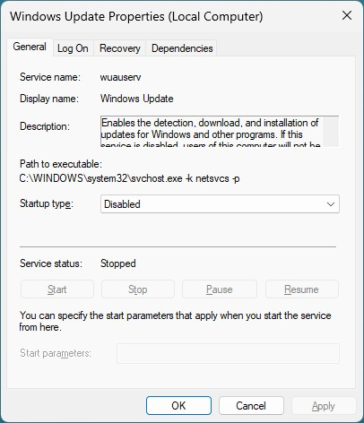
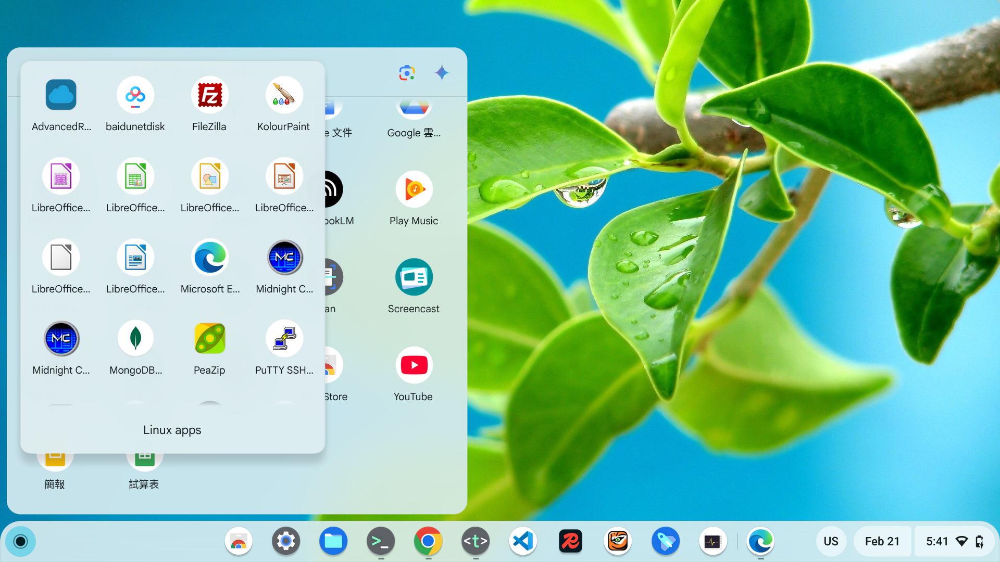
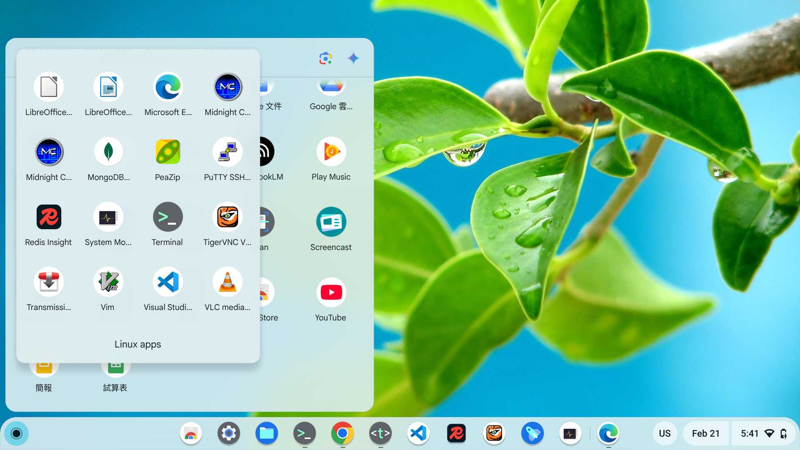
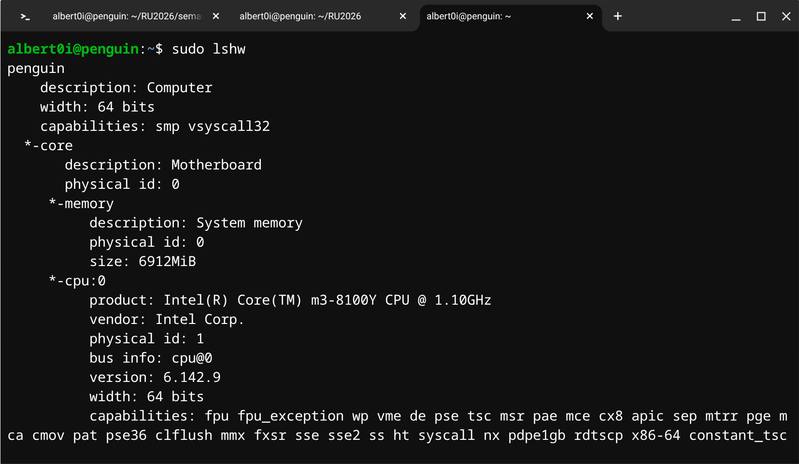
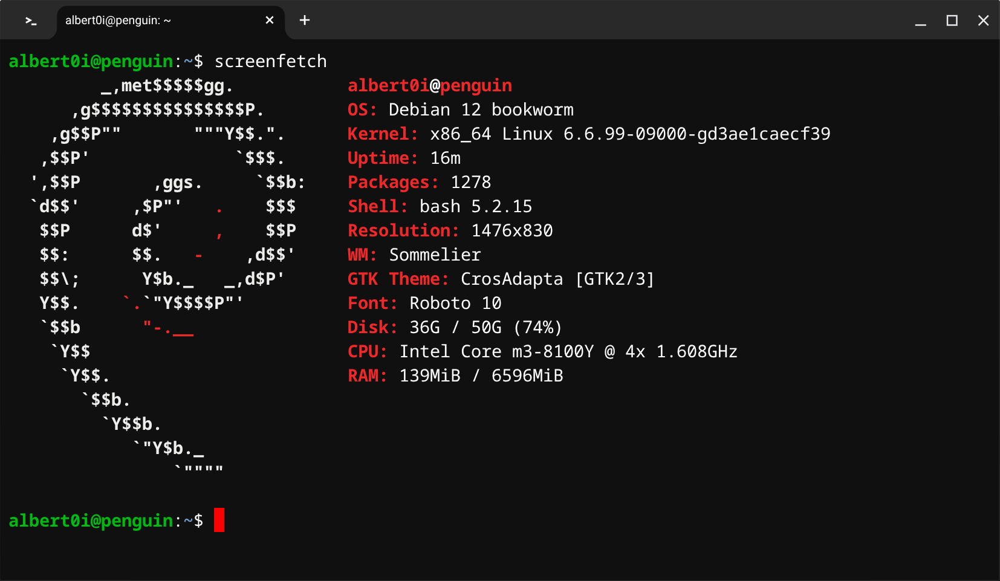

### [The Road Not Taken](https://www.poetryfoundation.org/poems/44272/the-road-not-taken) <br />── A Quest for Desktop Replacements 

> "Slavery is the law of life, and it is the only law, for it must be
observed: there is no revolt possible, no way to escape it. Some are
born slaves, others become slaves, and still others are forced to
accept slavery. Our faint-hearted love of freedom – which, if we had
it, we would all reject, unable to get used to it – is proof of how
ingrained our slavery is."<br />
"A escravatura é a lei da vida, e não há outra lei, porque esta tem de cumprir-se, sem revolta possível nem refúgio que achar. Uns nascem escravos, outros tornam-se escravos, e a outros a escravidão é dada. O amor cobarde que todos temos à liberdade — que, se a tivéssemos, estranharíamos, por nova, repudiando-a — é o verdadeiro sinal do peso da nossa escravidão."<br />
── [The Book of Disquiet by Fernando Pessoa](https://dn720004.ca.archive.org/0/items/english-collections-1/Book%20of%20Disquiet%2C%20The%20-%20Fernando%20Pessoa.pdf)

> "In a world without walls and fences, who needs windows and gates?"── [Alain Ruellan](https://www.linkedin.com/posts/alain-ruellan-0b775018_in-a-world-without-walls-and-fences-who-activity-7118788566607908864-aYjh?trk=public_profile_share_view)

> "To be clear: Windows isn’t bad. I actually like it. But the direction of Windows 11 is."── [Builtbybel](https://github.com/builtbybel/Winslop)


#### Prologue 
The day when tools you use for decades no longer serve you but the corporation. The day when AI accompanies with you on treading every flagstones. I shudder in sweat as if I were naked... Alas! This is wrong, this is *ALL* wrong... 


As an inveterate writer, it is my responsibility to pen down whirlpool and turbulence of this year. This is not about uninstalling and installing software, this is about the change of rudder and rigging, the change of course of mind and life.  


#### I. The Ignition
In January of 2026, multiple Linux distros have been tested, which includes: 
- [Linux Mint](https://linuxmint.com/)
- [MX Linux](https://mxlinux.org/)
- [Zorin OS](https://zorin.com/os/)
- ... 

The third one is chosen not because the first two are not good. It's a matter of sense and sensibility, not to do with functionality and logicality. 

> Zorin OS comes with all the essential apps you need out of the box, so you can get working right away. Discover thousands of powerful apps from the built-in [Software store](https://help.zorin.com/docs/apps-games/install-apps/#software-store). 

More apps can be found in: 
- [Alternatives to Windows Apps](https://help.zorin.com/docs/apps-games/alternatives-to-windows-apps/)
- [AlternativeTo.net](https://alternativeto.net/)

You can even run many Windows apps in Zorin OS with [Windows App Support](https://help.zorin.com/docs/apps-games/windows-app-support/).

- [Wine](https://www.winehq.org/)
- [Bottle](https://usebottles.com/)
- [WinBoat](https://www.winboat.app/)

IMHO, I won't *recommend* running a dual boot system or running Linux plus virtualization software such as [virtual box](https://www.virtualbox.org/)! That would deviate from our goal. 


#### II. Windows 11 Predicament
.JPG)


I have tried hard to inhibit it from updating but in vain... I found it *rotten to the heart*, the update behaviour is triggered automatically on event base *and* on time base. It is hard coded in kernel level, there is practically no way to stop it, let alone to remove it. 



Strategies I employ includes: 
1. Continuously checking and stoping `Windows Update Service`*manually*, which makes me almost delirious;
2. Turn off WIFI connection *completely*, which makes my computer almost a brick;
3. Use `Parental controls` on router to block internet connection if WIFI is accidentally left on.

Once the update is on its way, the `Shutdown` option becomes `Update and Shutdown` and you are trapped! The only way to escape is to open a `cmd` and type: 
```
shutdown -s -t 0
```

As soon as you run this command, Windows will begin shutting down right away — no countdown, no waiting period. It’s the fastest way to trigger a shutdown from the command line. But there is a catch... 

---
**Caveat from AI**

When you run a shutdown command like:  

```bash
shutdown -s -t 0
```  

Windows will indeed shut down immediately — but if there’s a **pending update**, things change a bit.  

**🔍 How Pending Updates Affect Shutdown**
- **Normal shutdown**: If no updates are pending, the system powers off right away.
- **Pending updates**: When Windows has already staged updates (downloaded and ready to install), the shutdown options in the Start menu change to **“Update and Shutdown”** or **“Update and Restart.”**
- **Command-line shutdown**: Using `shutdown -s -t 0` bypasses the Start menu, but if updates are already staged, Windows may still apply them during shutdown. *In other words, you can’t always escape — the OS treats shutdown as an opportunity to finish the update process*.
- **Force shutdown**: If you use `shutdown /s /f /t 0` (with `/f` to force-close apps), you can sometimes skip the update cycle, but this risks leaving updates half-applied, which can cause issues.

⚖️ **Bottom Line**
- The command works, but pending updates can *override* it.
- Windows *prioritizes* completing updates once they’re staged, so even command-line shutdowns may *trigger* them.
- The *only* way to truly avoid it is to pause or disable updates before they reach the “pending install” stage.

---

The next day, when you turn on the computer, the war continues like clockwork. Good luck! 

Without further ado, let's talk about the softwares, besides these bundled by **ASUS** and those pre-installed by **Microsoft**, which consumes more than 40G, Following is the list: 

| **Application** | **Cross-platform** | **Alternative** |
| ----------- | ----------- | ----------- |
| [Avast Free AntiVIrus](https://www.avast.com/free-antivirus-download#pc) | no | no |
| [Desktop Restore](https://www.majorgeeks.com/files/details/desktop_restore.html) 1.7.2.083 | no | no |
| [EaseUS Todo Backup Free 2025](https://www.easeus.com/download/tbf-download.html?srsltid=AfmBOopjxoA-5S-s9NZHvRwlyVqlGJzmH-HHgeyzu8L7sf7iAfGGXsuM) | no | no |
| [FileZilla](https://filezilla-project.org/) 3.68.1 | yes | --- |
| [FreeFileSync](https://freefilesync.org/) | yes | --- |
| [Git](https://git-scm.com/) | yes | --- |
| [GnuWin32: Make](https://gnuwin32.sourceforge.net/packages/make.htm)-3.8.1 | yes | --- |
| [GnuWin32: sed](https://gnuwin32.sourceforge.net/packages/sed.htm)-4.2.1 | yes | --- |
| [Google Chrome](https://www.google.com/chrome/) | yes | --- |
| [HandBrake](https://handbrake.fr/) 1.8.2 | yes | --- |
| [iTunes](https://www.apple.com/itunes/) 12.10.11 | no | no |
| [MariaDB](https://mariadb.com/)  11.7.2 | yes | --- |
| [Microsoft Visual Studio Code](https://code.visualstudio.com/) | yes | --- |
| [MongoDB Compass](https://www.mongodb.com/products/tools/compass) | yes | --- |
| [Mozilla Thunderbird](https://www.thunderbird.net/en-US/) | yes | --- |
| [Node.js](https://nodejs.org/en) | yes | --- |
| [Notepad++](https://notepad-plus-plus.org/downloads/) | no | yes |
| [NVM for Windows](https://www.nvmnode.com/) 1.2.2 | yes | --- |
| [Ollama](https://ollama.com/) 0.13.5 | yes | --- |
| [Open-Shell](https://open-shell.github.io/Open-Shell-Menu/) | no | no |
| [Pea](https://peazip.github.io/) 10.0.0 | yes | --- |
| [Putty](https://putty.org/index.html) release 0.81 | yes | --- |
| [RealVNC Viewer](https://www.realvnc.com/en/connect/download/viewer/) 7.12.1 | no | yes |
| [Redis](https://github.com/zkteco-home/redis-windows) 8.4.0 | yes | --- |
| [Redis Insight](https://redis.io/insight/) 2.70.1 | yes | --- |
| [TightVNC](https://www.tightvnc.com/download.php) | no | yes |
| [Transmission](https://transmissionbt.com/) | yes | --- |
| [VLC media player](https://www.videolan.org/vlc/) 4.0.6 | yes | --- |
| [WinSCP](https://winscp.net/eng/download.php) 6.3.5 | yes | --- |
| [百度網盤](https://pan.baidu.com/disk/main) | yes | --- |

Software occasionally used: 

| **Application** | **Cross-platform** | **Alternative** |
| ----------- | ----------- | ----------- |
| [edge](https://www.microsoft.com/en-us/edge/download?form=MA13FJ) | yes | --- |
| [HeidiSQL](https://www.heidisql.com/) | yes | --- |
| [Paint](https://www.microsoft.com/en-us/windows/paint) | no | yes |
| [ConvertZ](https://www.azofreeware.com/2006/03/convertz-802.html) | no | no |
| [ASS2SRT](https://apps.microsoft.com/detail/9p6zjkkntck1?hl=en-US&gl=SA) | no | no |


#### III. Zorin


##### **Edge Case 1**: 
1. [ConvertZ](https://www.azofreeware.com/2006/03/convertz-802.html)
> 中文簡繁內碼轉換器 - ConvertZ，簡單易用而且功能強大的中文內碼轉換工具，支援 GBK、Big5、HZ、Shift-JIS、JIS、EUC-JP、Unicode Little Endian、Unicode Big Endian、及 UTF-8 編碼，讓您輕鬆的對純文字檔案、檔案/資料夾名稱、剪貼簿文字、及 MP3 ID3 標籤在上述編碼之間進行轉換。


2. [ASS2SRT](https://apps.microsoft.com/detail/9p6zjkkntck1?hl=en-US&gl=SA) 
> A small tool designed specifically for Windows users to convert between ASS subtitles and SRT subtitles requires the installation of the. NET Desktop Runtime to function properly. This APP is available for free trial for 7 days. After that, you will need to pay to


1. [WineHQ](https://www.winehq.org/)

2. [Bottles - Run Windows Software on Linux](https://usebottles.com/)


##### **Edge case 2**: [Garmin Express](https://www.garmin.com/en-US/software/express/windows/)
> Use Garmin Express to update maps and software, sync with Garmin Connect and register your device. This desktop software notifies you when updates are available and helps you install them.

**System Requirements**

- Windows 10 or newer, Microsoft .NET 4.7.2 (included)
- 1024 x 768 display, USB port and 1 GB RAM
- High-speed internet access (not for use with dial-up, mobile or satellite connections)
- May require up to 20 GB free disk space
- For users running Windows 8 or older, please [download version 7 of Garmin Express for Windows](https://download.garmin.com/omt/express/GarminExpressWin7.exe).

[WineHQ AppDB](https://appdb.winehq.org/objectManager.php?sClass=application&iId=17447)
[Garmin Express](https://appdb.winehq.org/objectManager.php?sClass=version&iId=40213)

**Installation instructions**

The installation is quite basic. Download the installer with the links provided, e.g. to /tmp. Then proceed to create a new prefix somewhere your user has write permissions to, e.g. in `/opt/garmin/`:
```
sudo mkdir -p /opt/garmin/ 
cd /opt/garmin/
sudo chown alberto:alberto garmin 
cd garmin
export WINEPREFIX=/opt/garmin/
wineboot -i
```

Install the `.NET Framework 4.7.2` in there. --force is needed to prevent winetricks from not completing installation because some of the dotnet verbs may be broken:
```
winetricks --force dotnet472
```


Now execute GarminExpress.exe in there.
```
wine ./GarminExpress.exe
```
> ["This application could not be started" error when running a .NET Framework application](https://learn.microsoft.com/en-us/dotnet/framework/install/application-not-started?version=v2.0.50727&processName=LegacyApplicationsUninstaller.exe&platform=0009&osver=5&isServer=0&shimver=4.0.30319.0)
s

That's about it, really. I additionally went into the settings and disabled launch on "boot" to remove possible complications this may cause, if any.

To simplify launching you can create a .desktop file and place it into `/usr/share/applications/` to be able to launch it with your DE. Otherwise, export the wineprefix and launch:

```
wine "/opt/garmin/drive_c/Program Files (x86)/Garmin/Express/express.exe"
```

**Remember to mount the device!**

All tested Garmin devices present themselves as mass storage media to Linux, so their file system is browsable. If the issue arises that your device is not detected, check if it's mounted read-write. Not all distributions are configured to auto-mount such media.


##### **Edge Case 3**: [iTunes](https://www.apple.com/itunes/)
> The latest entertainment apps now come installed with the latest macOS. Upgrade today to get your favorite music, movies, TV shows, and podcasts. You can join Apple Music and stream — or download and play offline — millions of songs, ad‑free.

1. [WinBoat](https://www.winboat.app/)
2. [Download Windows 11](https://www.microsoft.com/en-in/software-download/windows11)
3. [Download Windows 10 ISO files, save a copy before end of support](https://www.windowslatest.com/2025/08/08/download-windows-10-iso-version-22h2-before-end-of-support/)
4. [iTunes 12.10.11 for Windows (Windows 64 bit)](https://support.apple.com/en-us/106372)

[iTunes 12 for Windows - Technical Specifications](https://support.apple.com/en-us/112029)

**Hardware**:

- PC with a 1GHz Intel or AMD processor with support for SSE2 and 512MB of RAM

- To play Standard Definition video from the iTunes Store, an Intel Pentium D or faster processor, 512MB of RAM, and a DirectX 9.0-compatible video card is required.

- To play 720p HD video, an iTunes LP, or iTunes Extras, a 2.0GHz Intel Core 2 Duo or faster processor, 1GB of RAM, and an Intel GMA X3000, ATI Radeon X1300, or NVIDIA GeForce 6150 or better is required.

- To play 1080p HD video, a 2.4GHz Intel Core 2 Duo or faster processor, 2GB of RAM, and an Intel GMA X4500HD; ATI Radeon HD 2400; NVIDIA GeForce 8300 GS or better is required.

- Screen resolution of 1024x768 or greater; 1280x800 or greater is required to play an iTunes LP or iTunes Extras

- 16-bit sound card and speakers

- Internet connection to use Apple Music, the iTunes Store, and iTunes Extras

- iTunes-compatible CD or DVD recorder to create audio CDs, MP3 CDs, or backup CDs or DVDs. Songs from the Apple Music catalog cannot be burned to a CD.

**Software**:

- Windows 7 or later

- 64-bit editions of Windows require the iTunes 64-bit installer

- 400MB of available disk space

- Some third-party visualizers may no longer be compatible with this version of iTunes. Please contact the developer for an updated visualizer that is compatible with iTunes 12.1 or later

- Apple Music, iTunes Store, and iTunes Match availability may vary by country

- Apple Music trial requires sign-up and is available for new subscribers only. Plan automatically renews after trialor later


Wine for older software and simple program.

Running a dual-boot system or linux with virtual box is a technical compromise solution, which are inconvenient for daily use, and so does WinBoat. Stress on integration instead of virtualization. 

Windows subsystem for Linux running on a docker virtual machine. 

Integration instead of emulation. Run a full-fledged Windows VM. 
Not specifically innovative but a clever composite of multiple mature techniques. 

Pros: 100% compability. Anything can be run on a VM and can be run on WinBoat in theory. 

FreeRDP combine remote windows protocol. 

Cons: Still in beta, not rock solid. Multiple prerequisites and huge resource consumption, less performant. No GPU acceleration pass-through for the time being. 

**Caveat**: 

1. It is illegal to use unactivated version of Windows;
2. Microsoft does allow install and use unactivated version of Windows for evaluation and temporary use but not for day-to-day long term use;
3. Use of unactivated version of Windows may incur lawsuit and punishment but not for home use. 

- [Seamless Compatibility? The Truth behind WinBoat](https://youtu.be/ST-dteJZuI4)
- [The End of Dual Boot: Run Windows Inside Linux Like Magic!](https://youtu.be/QwFxoDCXlM8)


#### IV. Chromebook








Intel(R) Core(TM) m3-8100Y CPU @ 1.10GHz
> The Intel Core m3-8100Y is an ultra-low-power, 8th-generation dual-core processor designed for thin-and-light laptops, 2-in-1s, and tablets. Operating at a base frequency of 1.10 GHz, it boasts a turbo boost up to 3.40 GHz. It is ideal for basic productivity tasks, with a very low 5W TDP, and features Intel UHD Graphics 615.

Key Specifications & Performance:

- Cores/Threads: 2 cores / 4 threads (Hyper-Threading).
- Frequency: 1.10 GHz Base, 3.40 GHz Turbo.
- Graphics: Integrated Intel® UHD Graphics 615.
- TDP: 5W (extremely energy-efficient).
- Cache: 4 MB Intel® Smart Cache.
- Use Case: Ideal for light browsing, document editing, and mobility rather than heavy processing.

> The m3-8100Y is often found in devices like the Microsoft Surface Go 2 and various ASUS Chromebooks. It offers decent performance for daily tasks but is not meant for gaming or intense video editing. 

> Crostini is the official method for running Linux applications directly on ChromeOS, offering a secure, containerized Debian-based environment. It enables developers and users to install IDEs, editors, and terminal tools, which integrate seamlessly into the Launcher and share files with the host system. It is supported on most modern Chromebooks via the settings menu.

> On Ubuntu, **Flatpak** and **Snapd** are two modern systems for installing applications, each with its own ecosystem.  

> **Flatpak** was created by the open-source community to provide a universal way of packaging apps that run across different Linux distributions. It emphasizes sandboxing, meaning applications are isolated for better security, and it relies on shared “runtimes” to reduce duplication.  

> **Snapd**, on the other hand, is Canonical’s system for managing **Snaps**, tightly integrated with Ubuntu. Snaps bundle all their dependencies, update automatically, and can roll back if something goes wrong. This makes them convenient, especially for Ubuntu users, though they’re heavier than Flatpaks.  

> Flatpak is community-driven and cross-distro, while Snapd is Ubuntu’s native solution with automatic updates. Both aim to simplify Linux app installation, but they reflect different philosophies of packaging and distribution.  

> Both **Flatpak** and **Snapd** can work on **Debian**, though they aren’t installed by default.

- [Debian Quick Setup - Follow these simple steps to start using Flatpak](https://flatpak.org/setup/Debian)
- [Install snap on Debian](https://snapcraft.io/docs/tutorials/install-the-daemon/debian/)
- [apt-get command in Linux with Examples](https://www.geeksforgeeks.org/linux-unix/apt-get-command-in-linux-with-examples/)

Recommended to run first
```
sudo apt update && sudo apt upgrade -y
```

##### Domestic
[pbpaste && pbcopy for Ubuntu Linux 20.04](https://gist.github.com/diegopacheco/75de31680b3eaeb8824e994b81889f82)
```
sudo apt-get install xclip -y
```

Create Alias
```
alias pbcopy='xclip -selection clipboard'
alias pbpaste='xclip -selection clipboard -o'
```

Try out
```
pbcopy < /proc/cpuinfo 
pbpaste > tst.txt
cat tst.txt 
```

`~./bash_aliases`
```
alias ll='ls -l'
alias la='ls -al'
alias l='ls -CF'
alias cls='clear'
alias ver='cat /etc/os-release'
alias edit='nano'
alias type='cat'
alias systeminfo='lshw'
alias ipconfig='ip a'
alias size='sudo du -h --max-depth=1'

alias pbcopy='xclip -selection clipboard'
alias pbpaste='xclip -selection clipboard -o'
```

Install the fortune and cowsay 
```
apt-get install fortune cowsay 
```
Add `fortune | cowsay` at the end of `~./bashrc`

`~./bash_logout`
```
# ~/.bash_logout: executed by bash(1) when login shell exits.

# when leaving the console clear the screen to increase privacy

if [ "$SHLVL" = 1 ]; then
    [ -x /usr/bin/clear_console ] && /usr/bin/clear_console -q
fi

echo
echo Goodbye $(whoami), have a nice day!
sleep 1
clear
```

##### Development
Install Docker
> To install Docker on a Chromebook, you must use the built-in Linux development environment (Crostini) and follow the standard Docker Engine installation steps for Debian Linux. Docker Desktop for Linux may not run correctly in the Crostini environment.

**1. Update the apt package index and install necessary prerequisites**
```
sudo apt-get install apt-transport-https ca-certificates curl gnupg2 software-properties-common -y
```

**2. Add Docker's official GPG key**
```
curl -fsSL https://download.docker.com/linux/debian/gpg | sudo apt-key add -
```

**3. Set up the stable Docker repository for your architecture (usually amd64 or arm64, depending on your Chromebook's CPU)**:
```
sudo add-apt-repository "deb [arch=amd64] https://download.docker.com/linux/debian $(lsb_release -cs) stable"
```

**4. Install the latest version of Docker Engine and containerd**
```
sudo apt-get install docker-ce docker-ce-cli containerd.io -y
```

**Add your user to the docker group to run Docker commands without sudo (this is highly recommended)**
```
sudo usermod -aG docker $USER
```

> Reboot the Linux container for the group changes to take effect. The easiest way is to type sudo reboot in the terminal or simply restart your Chromebook.

Test installation with 
```
docker run hello-world
```

Run Redis
```
docker run --name redis -d -p 6379:6379 redis:8.4.0

redis-cli 
```

Run MariaDB
```
docker run --name mariadb -d -p 3306:3306 -e MARIADB_ROOT_PASSWORD=123456 mariadb:11.7.2

mysql -h 127.0.0.1 -u root -p
```

In case you may need: 
```
sudo apt install default-mysql-client redis-tools
```

Install SQLite CLI
```
sudo apt install sqlite3
```

Install Turso CLI
```
curl -sSfL https://get.tur.so/install.sh | bash
```

Install jq
```
sudo apt install jq
```

Install the [MongoDB Shell](https://www.mongodb.com/try/download/shell)


Install NVM 
```
curl -o- https://raw.githubusercontent.com/nvm-sh/nvm/v0.40.4/install.sh | bash
```

Install nodemon
```
npm install -g nodemon
```

##### Productivity
Install libreOffice
```
sudo apt install libreoffice
```

Install [ollama](https://ollama.com/download/linux)
```
curl -fsSL https://ollama.com/install.sh | sh
```

> WARNING: Unable to detect NVIDIA/AMD GPU. Install lspci or lshw to automatically detect and install GPU dependencies.
```
sudo apt update && sudo apt install pciutils lshw
```

Test with 
```
ollama run gemma3:1b 
```


To enable ollama API
```
systemctl status ollama
sudo systemctl edit ollama.service
```

Add the the following section
```
[Service]
Environment="OLLAMA_HOST=127.0.0.1:11434"
```

Restart ollama service
```
sudo systemctl restart ollama
```

Test ollama API on browser 
```
http://localhost:11434/api/tags
http://localhost:11434/api/ps
http://localhost:11434/api/version

https://docs.ollama.com/api/tags
```

Install the telnet and ftp
```
sudo apt install telnet
sudo apt install ftp
```

##### Miscellaneous
```
arc-linux-17.0.9-amd64.deb
baidunetdisk_4.17.7_amd64.deb
code_1.106.3-1764110892_amd64.deb
heidisql_12.15.1.1_amd64.deb
microsoft-edge-stable_145.0.3800.58-1_amd64.deb
mongodb-mongosh_2.7.0_amd64.deb
mongodb-compass_1.48.2_amd64.deb
peazip_10.7.0.LINUX.Qt6-1_amd64.deb
Redis-Insight-linux-amd64.deb
```

> Screenfetch is a Bash-based command-line tool for Debian that displays system information, such as OS version, kernel, uptime, and memory, alongside an ASCII distribution logo. It is easily installed via `sudo apt install screenfetch` and run by typing `screenfetch` in the terminal, making it ideal for sharing system specs.



[Winboat.app on Debian — Complete Installation Tutorial](https://youtu.be/Rqec-jmbQRs)


#### V. Bibliography 
1. [Switch Your Organization From Windows in 5 Steps](https://help.zorin.com/docs/getting-started/switch-your-organization-from-windows/)
2. [I Tried Every “Windows-Like” Linux Distro — Only ONE Truly Replaced Windows (Full Test)](https://youtu.be/ra7JNc9NEYs)
3. [Run Windows Apps on Linux (Wine Explained for Beginners)](https://youtu.be/gKKW3qZ-NZw)
4. [Winboat.app on Debian — Complete Installation Tutorial](https://youtu.be/Rqec-jmbQRs)
5. [Run Windows Apps on Linux Mint 22.3 with WinBoat (Full Beginner Guide)](https://youtu.be/PqpHaxATY3E)
6. [Windows Sucks. I'm Using DOS From Now On.](https://youtu.be/mwLIgdRj5bI)
7. [I Tried Zorin OS as a Windows 11 User (It Wasn’t What I Expected)](https://youtu.be/qe_epHU_opo)
8. [A Linux Distro Made For 99% of People](https://youtu.be/L5q36VojWk0)
9. [The Book of Disquiet by Fernando Pessoa](https://dn720004.ca.archive.org/0/items/english-collections-1/Book%20of%20Disquiet%2C%20The%20-%20Fernando%20Pessoa.pdf)


#### VI. Appendix from AI
Here’s the clear percentage breakdown, using the **Core 2 Duo** as the baseline at **100%**:

📊 **Relative Processing Power**

| Processor | Approx. PassMark Score | Relative to Core 2 Duo |
|-----------|-------------------------|------------------------|
| **Intel Core 2 Duo (2006)** | ~1,000–2,500 | **100%** |
| **Intel Atom N270 (2008)** | ~300 | **~15–25%** |
| **Intel Core m3‑8100Y (2018)** | ~3,000 | **~120–300%** |
| **Intel Core i5‑1335U (2022)** | ~17,000 | **~700–1,700%** |


#### Epilogue
```
The Road Not Taken
By Robert Frost

Two roads diverged in a yellow wood,    兩條路在黃葉林中分歧， 
And sorry I could not travel both.      可嘆我無法兩者都挑。
And be one traveler, long I stood       單身行路的我久久佇立，
And looked down one as far as I could   向其中一條極目望去，
To where it bent in the undergrowth;    直看到被林木掩住的轉角。
 
Then took the other, as just as fair,   然後我走了另一條路，一樣美麗，
And having perhaps the better claim,    而且還或許更加合宜，
Because it was grassy and wanted wear;  因爲它青草萋萋看似乏人問津；
Though as for that the passing there    雖説兩條路上行人來去，
Had worn them really about the same,    踩踏的程度其實相差無幾。
 
And both that morning equally lay       當天早上兩條路同樣被落葉覆蓋，
In leaves no step had trodden black.    沒有黑色的足跡沾染。
Oh, I kept the first for another day!   啊，頭一條路留待改日再來！

I shall be telling this with a sigh     很多很多年以後在某處，
Somewhere ages and ages hence:          我會嘆息著將此事提起：
Two roads diverged in a wood, and I—    森林中的路分岔成兩條，而我 –
I took the one less traveled by,        我選了較少人走的那條路，
And that has made all the difference.   於是再來的一切都迴然相異。

譯文: https://doctork.pixnet.net/blog/posts/11406125902
```


### EOF (2026/04/01)