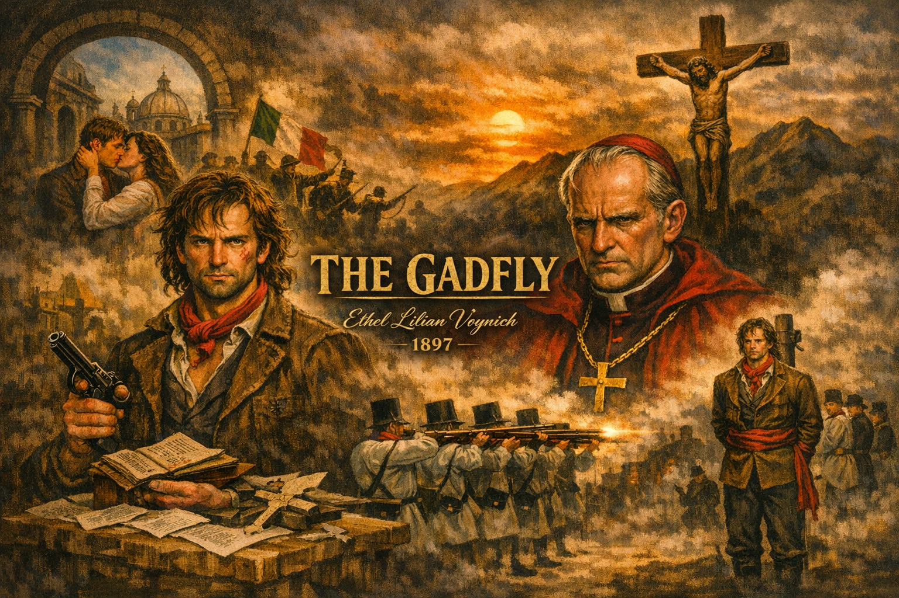

# **The Gadfly: A Revolutionary Martyr’s Journey**  
### *Ethel Lilian Voynich · 1897*

---

## 📖 Introduction

Ethel Lilian Voynich’s *The Gadfly* (1897) is a historical novel set in 1840s Italy during the Risorgimento, the nationalist struggle against Austrian rule. It tells the story of Arthur Burton, a young Englishman whose journey from devout Catholic to disillusioned revolutionary culminates in martyrdom. The novel blends personal tragedy with political urgency, making it one of the most enduring revolutionary narratives of its time—especially in the Soviet Union, where it became a cultural icon.

---

## 🧑‍🎓 Arthur Burton: The Idealist

Arthur Burton begins as a deeply religious young man, studying in Italy and involved in the revolutionary movement *Young Italy*. His mentor, Padre Montanelli, is a priest who guides him spiritually and intellectually. Arthur is also romantically attached to Gemma, a fellow revolutionary. His life seems full of promise: faith, love, and political purpose.

But Arthur’s idealism is fragile. He is torn between his devotion to the Church and his commitment to revolution. This tension sets the stage for his eventual transformation.

---

## 💔 Betrayal and Disillusionment

Arthur’s world collapses when he discovers betrayal on multiple fronts:

- **Montanelli’s secret**: Montanelli is revealed to be Arthur’s biological father, a truth concealed for years.  
- **The Church’s hypocrisy**: Arthur realizes the Church is complicit in political repression.  
- **Personal betrayal**: Misunderstandings and deceptions leave Arthur feeling abandoned by those he trusted most.

Shattered by these revelations, Arthur loses his faith. He fakes his death and disappears from Italy, leaving behind his old identity.

---

## 🕵️ Emergence of “The Gadfly”

Years later, Arthur returns under a new persona: **the Gadfly**, a cynical, sharp-tongued journalist. His writings mock the Church and Austrian authorities, inspiring revolutionaries and enraging the establishment. He reconnects with Gemma, though their relationship is strained by his bitterness and secrecy.

The Gadfly becomes a symbol of resistance. His satire exposes hypocrisy, and his defiance embodies the revolutionary spirit. Yet his personal scars make him a tragic figure, unable to fully reconcile with love or faith.

---

## ⚔️ Revolutionary Struggle

Arthur’s writings and actions galvanize the movement. He works under the alias Rivarez, distributing pamphlets and organizing resistance. His wit and courage make him both admired and hunted. The authorities see him as a dangerous agitator, while revolutionaries view him as a hero.

Gemma, still committed to the cause, struggles with her feelings for Arthur. Their bond is rekindled but remains fraught with pain and unresolved tension.

---

## 🧑‍🤝‍🧑 Confrontation with Montanelli

Montanelli, now a Cardinal, is tormented by guilt. His paternal love for Arthur clashes with his loyalty to the Church. Their final confrontation is deeply tragic:

- Montanelli pleads with Arthur to abandon his revolutionary path.  
- Arthur refuses, choosing defiance over reconciliation.  
- The ideological and personal divide between them is irreconcilable.

This conflict symbolizes the clash between faith and reason, authority and rebellion, father and son.

---

## 🔫 Arrest and Execution

Arthur is eventually captured by Austrian forces. Despite torture, he refuses to betray his comrades. His trial is swift and unjust. He is sentenced to death by firing squad.

In his final moments, Arthur remains defiant. He faces execution with dignity, becoming a martyr for the revolutionary cause. His death devastates Montanelli and Gemma, leaving them to grapple with grief and guilt.

---

## 🧠 Themes

- **Faith vs. Doubt**: Arthur’s loss of faith drives his transformation.  
- **Betrayal**: Personal and institutional betrayals shape his destiny.  
- **Revolutionary Idealism**: The Gadfly embodies resistance against oppression.  
- **Martyrdom**: Arthur’s death symbolizes the enduring power of ideas.  

---

## 🏛 Historical Context

The novel is set during the Italian Risorgimento, a time of nationalist uprisings against Austrian rule. Voynich, though English, was influenced by socialist and revolutionary ideas. Her novel reflects both the political struggles of Italy and broader themes of resistance.

---

## 🎭 Cultural Legacy

- **Soviet Union**: *The Gadfly* became a revolutionary classic, required reading in schools.  
- **Film**: The 1955 Soviet adaptation by Aleksandr Faintsimmer brought the story to life.  
- **Music**: Dmitri Shostakovich’s *Gadfly Suite* (Op. 97a) remains iconic.  
- **Opera**: Antonio Spadavecchia’s adaptation (1955) reinforced its cultural impact.  

---

## 📚 Conclusion

*The Gadfly* is more than a novel—it is a meditation on faith, betrayal, revolution, and sacrifice. Arthur Burton’s journey from idealist to martyr captures the emotional and philosophical turmoil of rebellion. His defiance and death resonate as symbols of courage and conscience.

Though written by an Englishwoman, the novel found its greatest audience in the Soviet Union, where Arthur’s martyrdom was celebrated as a revolutionary ideal. Today, *The Gadfly* endures as a timeless exploration of the human spirit in the face of oppression.

