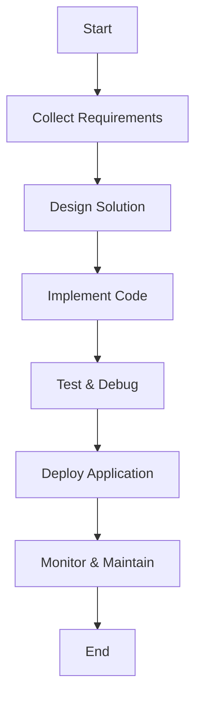
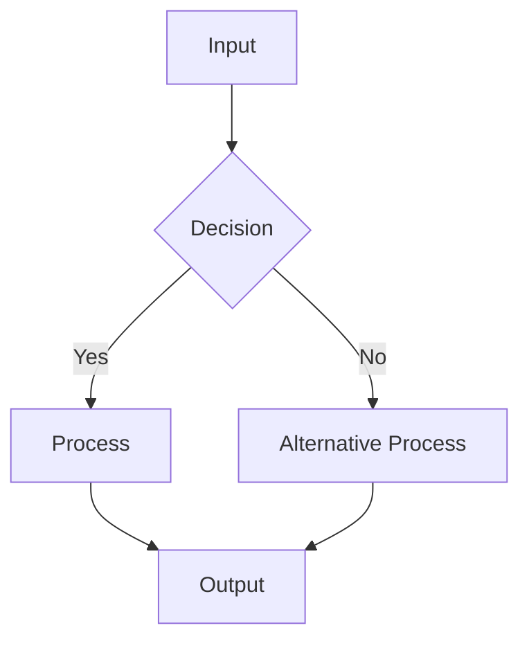

```mermaid
flowchart TD
    A[Start] --> B[Collect Requirements]
    B --> C[Design Solution]
    C --> D[Implement Code]
    D --> E[Test & Debug]
    E --> F[Deploy Application]
    F --> G[Monitor & Maintain]
    G --> H[End]
```

```mermaid
flowchart TD
    A[Input] --> B{Decision}
    B -->|Yes| C[Process]
    B -->|No| D[Alternative Process]
    C --> E[Output]
    D --> E[Output]
```