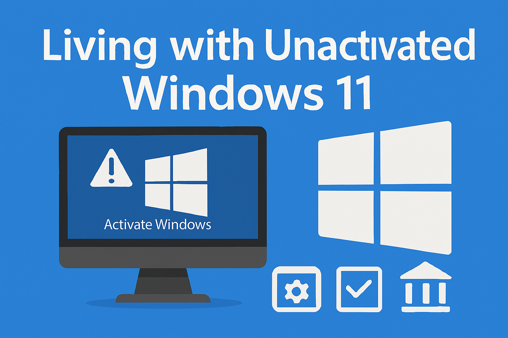
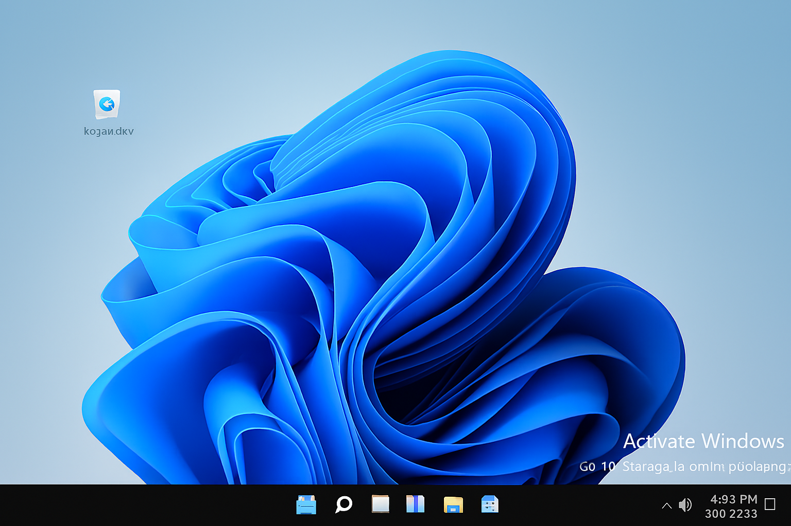

Microsoft Windows is the backbone of modern computing. With Windows 11, Microsoft continues its tradition of offering multiple editions, licensing models, and upgrade paths. But many users face the practical question: *what happens if I install Windows 11 without a product key?* This article explores that scenario in depth, covering installation behavior, lost features, licensing rules, edition comparisons, and the legal implications for both personal and corporate environments.

---

## 1. Installing Windows 11 Without a Product Key

When you boot from a Windows 11 ISO, the installer usually asks for a product key. If you skip this step, the behavior depends on the ISO and your hardware:

- **Multi‑edition ISO**: Most official ISOs contain Home, Pro, Education, and Enterprise editions. If no key is entered, the installer may prompt you to choose an edition.  
- **OEM license embedded in firmware**: Many laptops and desktops ship with a digital license stored in BIOS/UEFI. In this case, Windows setup automatically detects the license and installs that edition (usually Home).  
- **No OEM license, no prompt**: If neither a key nor an embedded license is present, the installer defaults to **Windows 11 Home**.  

Thus, in the “no key, no OEM license, no prompt” situation, you end up with **Home edition unactivated**.

---

## 2. What Happens After Installation Without Activation

Windows 11 runs normally even without activation. You can install apps, receive updates, and use core features. But Microsoft deliberately restricts personalization options to remind you that you’re running unlicensed software.

### Features That Still Work
- Security updates and driver support.  
- Internet connectivity and networking.  
- Productivity apps, browsers, and media players.  
- File Explorer, Settings, and system tools.  

### Features You Lose
- **Desktop background**: You cannot change the wallpaper or set a slideshow.  
- **Themes and colors**: Accent colors, custom themes, and transparency effects are locked.  
- **Lock screen customization**: No custom images or widgets.  
- **Taskbar tweaks**: Limited ability to reposition or personalize icons.  
- **Microsoft Store personalization packs**: Restricted until activation.  

The operating system remains functional, but visually bland. The watermark “Activate Windows” sits in the corner as a constant reminder.

---

## 3. Licensing Models Explained

Microsoft offers several licensing models, each with different rules:

- **Retail License (Home/Pro)**  
  - Purchased directly from Microsoft or authorized resellers.  
  - Valid for one computer at a time.  
  - Transferable: you can deactivate on one machine and activate on another.  

- **OEM License**  
  - Preinstalled on new computers.  
  - Permanently tied to the original hardware (motherboard).  
  - Not transferable.  

- **Enterprise/Volume License**  
  - Subscription‑based, sold to organizations.  
  - Covers multiple devices/users under one agreement.  
  - Includes upgrade rights as part of the subscription.  

---

## 4. Edition Comparison: Home vs Pro vs Enterprise

| Feature / Edition | Home | Pro | Enterprise |
|-------------------|------|-----|------------|
| Price (USD) | ~$139 | ~$199 | ~$7–12 per user/month |
| Devices Covered | 1 | 1 | Multiple (via subscription) |
| BitLocker Encryption | No | Yes | Yes, with advanced management |
| Remote Desktop Host | No | Yes | Yes |
| Group Policy Management | Limited | Full | Advanced |
| Hyper‑V Virtualization | No | Yes | Yes |
| Windows Sandbox | No | Yes | Yes |
| Assigned Access / Kiosk Mode | No | Yes | Yes |
| Advanced Security (Credential Guard, Device Guard) | No | No | Yes |
| Centralized Management | No | Limited | Full (Intune, SCCM) |
| Upgrade Rights | None | None | Included in subscription |

---

## 5. The “Two Homes, Two Computers” Scenario

A common question arises: if you own two homes and two computers, but only use one at a time, do you need two licenses? The answer is yes. Microsoft’s licensing is tied to the hardware, not your usage pattern. Even if you only power on one computer at a time, each machine requires its own license to remain activated.

---

## 6. Moving Drives Between Computers

Another scenario: what if you remove a hard drive from one computer and plug it into another? Windows will boot, but activation will fail. The license is bound to the hardware profile (motherboard, CPU, etc.), not the drive. Retail licenses can be transferred, but OEM licenses cannot. Enterprise agreements handle this differently, but they are not available for personal use.

---

## 7. Identical Hardware: Does It Fool Activation?

Suppose you have two computers with identical hardware. Would Windows treat them as the same device? In practice, no. Even tiny differences (network card IDs, BIOS serial numbers) make each hardware profile unique. Microsoft’s activation servers detect these differences, and one license will not reliably activate both machines.

---

## 8. Upgrade Paths: Windows 11 to Windows 12

Buying a Windows 11 license today does not guarantee a free upgrade to Windows 12. Microsoft has historically offered free upgrades (Windows 7 → 10, Windows 10 → 11), but these were promotional programs, not entitlements. Enterprise customers with subscriptions usually get upgrades included, but Home and Pro users must wait to see if Microsoft offers a similar promotion.

---

## 9. Legal Issues: Personal vs Company Use

### Personal Use
Running unactivated Windows at home is tolerated. You’ll see the watermark and lose personalization, but the OS works. Microsoft doesn’t aggressively enforce licensing against individuals.

### Company Use
Running unactivated Windows in a corporate environment is considered **software piracy**.  
- Companies are legally required to use properly licensed software.  
- Microsoft or third‑party auditors can conduct **software asset management audits**.  
- If unlicensed systems are found, the company may face fines, back‑payment of licenses, and reputational damage.  
- Enterprise agreements exist precisely to give companies compliant, scalable options.  

Thus, while individuals can “get by” with unactivated Windows, companies cannot.

---

## 10. Practical Advice for Using Unactivated Windows 11

If you’re short on funds, running Windows 11 unactivated is a viable option. You’ll have a secure, functional system, but you’ll sacrifice personalization and live with the watermark. When finances allow, buying a license unlocks the full experience and ensures compliance.

For businesses, however, unactivated Windows is a legal liability. Every device must be properly licensed, either through retail keys, OEM licenses, or enterprise volume agreements.

---

## 11. Conclusion

Windows 11’s licensing system is strict: one license per computer, tied to hardware. Installing without a key defaults to Home edition, unactivated, with cosmetic restrictions. Retail licenses are transferable, OEM licenses are locked, and Enterprise licenses are subscription‑based. Free upgrades to future versions are promotional favors, not guaranteed rights.  

For everyday users, the choice is clear: run unactivated if necessary, but plan to purchase a license when possible. For organizations, Enterprise licensing provides flexibility and upgrade rights. Either way, understanding the rules helps you avoid surprises and stay compliant.

---
